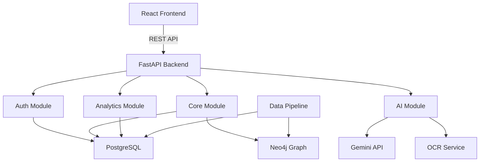
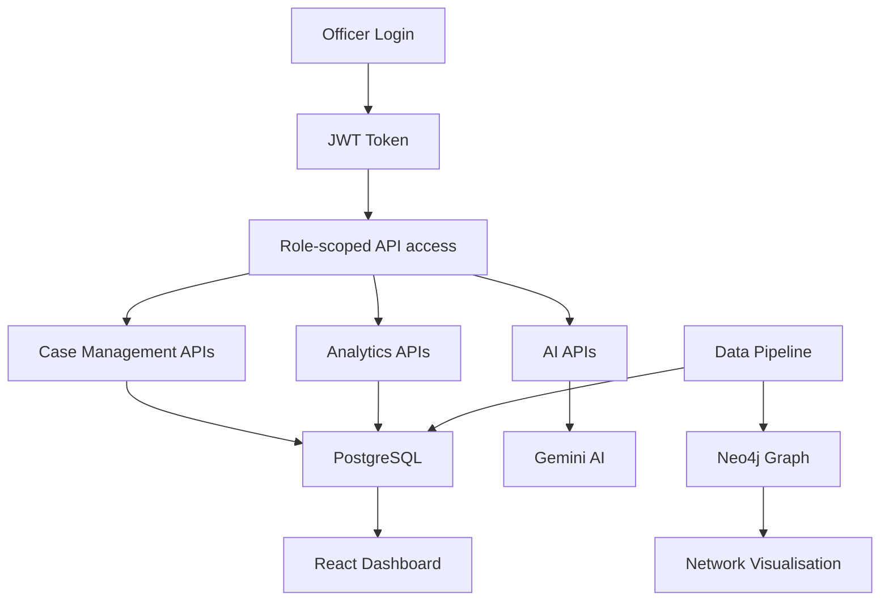

# Sentinel AI

## AI-Powered Crime Intelligence Operating System

> Full-stack criminal intelligence platform combining a FastAPI backend, React + TypeScript frontend, Google Gemini AI integration, PostgreSQL relational store, and Neo4j knowledge graph.

[](https://www.python.org/)
[](https://fastapi.tiangolo.com/)
[](https://react.dev/)
[](https://www.typescriptlang.org/)
[](https://www.postgresql.org/)
[](https://neo4j.com/cloud/aura/)
[](https://ai.google.dev/)

Sentinel AI is an end-to-end crime intelligence operating system designed for law enforcement. It centralises FIRs, suspects, evidence, digital forensics, financial trails, and AI-generated insights into a single operational platform. The system enforces role-based geographic access so that officers can only see records within their jurisdiction.

---

## Project Objectives

The system is designed to:

- Provide a unified operational platform for managing FIRs, crimes, suspects, evidence, and officers.
- Enforce jurisdiction-scoped data access through role-based authentication.
- Integrate Google Gemini AI for natural-language case assistance, OCR, investigative reports, and crime pattern analysis.
- Surface real-time analytics, KPIs, and geographic intelligence in a modern dashboard.
- Power a criminal network knowledge graph using Neo4j for relationship traversal.
- Generate and validate a reproducible synthetic crime dataset for development and QA.

## Problem Statement

Law enforcement agencies manage fragmented records across multiple siloed systems. Without a unified platform, connecting suspects to cases, tracing financial flows, analysing communication networks, and generating actionable reports requires manual effort across disparate sources.

Sentinel AI solves this by integrating relational case management, graph-based network analysis, AI intelligence assistance, digital forensics, and GIS into a single secure system.

## Why This Project Exists

Sentinel AI provides:

- A secure, role-scoped operational case management interface.
- AI-powered tools that reduce manual effort for report writing, OCR processing, and pattern matching.
- Graph and map-based visualisations for criminal network and geographic intelligence.
- A development-ready synthetic data ecosystem for safe testing and QA.

---

## 1. System Architecture



### Module responsibilities

| Module | Responsibility |
|---|---|
| `backend/auth/` | JWT authentication, RBAC, officer login |
| `backend/core/` | FIR, crime, suspect, evidence, officer, diary CRUD |
| `backend/analytics/` | Dashboards, KPIs, trend analysis, search |
| `backend/ai/` | OCR, AI assistant, report generation, pattern similarity |
| `database/` | SQLAlchemy models, repositories, migrations |
| `src/` | React + TypeScript frontend SPA |
| `backend/scripts/` | Synthetic data pipeline and database loaders |
| `neo4j/` | Graph service and Cypher query utilities |

---

## 2. Repository Structure

```text
SENTANAL-AI/
├── backend/
│   ├── auth/                    # JWT authentication and RBAC
│   ├── core/                    # Case, crime, suspect, evidence APIs
│   ├── analytics/               # KPI, search, and trend APIs
│   ├── ai/                      # Gemini AI, OCR, and report endpoints
│   ├── config/                  # Backend configuration
│   ├── data/                    # Generated CSV datasets
│   └── scripts/                 # Data pipeline, validation, and loaders
│       ├── generators/          # Domain-specific synthetic data generators
│       │   ├── core/
│       │   ├── crime/
│       │   ├── digital/
│       │   ├── intelligence/
│       │   └── relationships/
│       ├── pipeline/            # Dataset pipeline orchestration
│       ├── validation/          # Validation engine
│       └── database/            # PostgreSQL loader and Neo4j exporter
├── database/                    # SQLAlchemy models, connection, repositories
│   ├── models.py                # ORM models: User, FIR, Crime, Officer, Evidence …
│   ├── connection.py            # Database session factory
│   ├── repositories.py          # Data access layer
│   ├── queries.py               # Custom query functions
│   └── bulk_loader.py           # Bulk data loading utilities
├── src/                         # React + TypeScript frontend SPA
│   ├── pages/                   # Route-level page components
│   │   ├── Dashboard/
│   │   ├── CrimeDatabase/
│   │   ├── Investigation/
│   │   ├── CriminalNetwork/
│   │   ├── Analytics/
│   │   ├── GIS/
│   │   ├── AIAssistant/
│   │   ├── Reports/
│   │   └── Settings/
│   ├── components/              # Shared UI components
│   ├── api/                     # Axios API client functions
│   ├── routes/                  # React Router configuration
│   └── utils/                   # Shared utilities and helpers
├── neo4j/                       # Graph service utilities
├── analytics/                   # Standalone analytics modules
├── migrations/                  # Alembic database migrations
├── config/                      # Project-level configuration
├── main.py                      # Application entry point
├── requirements.txt             # Python dependencies
├── package.json                 # Node.js dependencies
├── vite.config.ts               # Vite frontend build config
└── README.md                    # This document
```

---

## 3. Backend Architecture

The backend is a FastAPI application organised into four domain modules, all mounted under `/api/v1`.

### API modules

| Router prefix | Module | Responsibility |
|---|---|---|
| `/api/v1/auth` | `backend/auth/` | Login, JWT issuance, token validation |
| `/api/v1/core` | `backend/core/` | FIR, crime, suspect, evidence, officers, diary |
| `/api/v1/analytics` | `backend/analytics/` | KPIs, search, trend analysis, district stats |
| `/api/v1/ai` | `backend/ai/` | OCR, AI assistant, reports, pattern similarity |

### Core API endpoints

| Method | Endpoint | Description |
|---|---|---|
| `POST` | `/auth/login` | Officer authentication and JWT issuance |
| `GET` | `/core/firs` | List FIRs scoped to user jurisdiction |
| `POST` | `/core/firs` | Register a new FIR |
| `GET` | `/core/firs/{fir_id}` | Retrieve a specific FIR |
| `GET` | `/core/crimes` | List crimes in user scope |
| `GET` | `/core/evidence` | List evidence items in user scope |
| `GET` | `/core/officers` | List officers in user jurisdiction |
| `GET` | `/core/districts` | List accessible districts |
| `GET` | `/core/entities` | Resolve suspects, vehicles, and victims for a case |
| `POST` | `/core/diary` | Add an investigation diary entry |
| `GET` | `/core/diary` | Retrieve diary entries |
| `POST` | `/ai/ocr` | Extract text from an image (Tesseract + Gemini fallback) |
| `POST` | `/ai/assistant` | Query the AI case assistant |
| `POST` | `/ai/report` | Generate an investigative brief for a case |
| `POST` | `/ai/translate` | Multilingual AI translation |
| `POST` | `/ai/analyze-digital-evidence` | Digital forensics analysis |
| `POST` | `/ai/voice-search` | Voice query transcription and search |
| `POST` | `/ai/pattern-similarity` | Find cases with similar crime patterns |

### Authentication and RBAC

Authentication uses JWT Bearer tokens issued on officer login. Every protected endpoint uses the `get_current_active_user` dependency to validate the token and load the officer's scope.

Access control is enforced at the service layer based on officer role:

| Role | Access |
|---|---|
| `SUPERADMIN` | All districts and all stations |
| `ADMIN` | All stations within assigned district |
| `OFFICER` | Own police station only |

Inactive accounts are rejected with HTTP 403. Expired or invalid tokens return HTTP 401.

---

## 4. Frontend Architecture

The frontend is a React 19 + TypeScript SPA built with Vite. Routing is handled by React Router v7. API calls use Axios against the FastAPI backend.

### Page modules

| Page | Route | Purpose |
|---|---|---|
| `Login` | `/login` | Officer authentication |
| `Dashboard` | `/dashboard` | KPI summary, recent cases, alert feed |
| `CrimeDatabase` | `/crimes` | Searchable FIR and crime registry |
| `CrimeDetails` | `/crimes/:id` | Detailed case view |
| `Investigation` | `/investigation` | Active investigation workspace |
| `CriminalNetwork` | `/network` | Neo4j-powered network graph visualisation |
| `Analytics` | `/analytics` | Charts, trends, and district-level statistics |
| `GIS` | `/gis` | Geographic crime map |
| `AIAssistant` | `/ai` | Chat interface for Gemini AI case queries |
| `OCRReview` | `/ocr` | Document OCR extraction and review |
| `Reports` | `/reports` | AI-generated investigative reports |
| `Settings` | `/settings` | User and system settings |

### Component structure

```text
src/components/
├── layout/          # Sidebar, topbar, and page shell
├── common/          # Reusable cards, tables, badges, and modals
├── ui/              # Primitive inputs, buttons, and form controls
└── animations/      # Lottie animation wrappers
```

### Frontend dependencies

| Package | Purpose |
|---|---|
| React 19 | UI component framework |
| React Router v7 | Client-side routing |
| TypeScript 6 | Static typing |
| Vite 8 | Development server and build tool |
| Tailwind CSS v4 | Utility-first styling |
| Axios | HTTP client for API requests |
| Recharts | Dashboard charts and visualisations |
| Lucide React | Icon library |
| Lottie React | Animation playback |

---

## 5. AI Module

The AI module is powered by Google Gemini and integrates into case management workflows.

### AI capabilities

| Feature | Endpoint | Description |
|---|---|---|
| OCR Extraction | `POST /ai/ocr` | Extract text from uploaded document images. Falls back from Tesseract to Gemini multimodal when Tesseract is unavailable |
| AI Case Assistant | `POST /ai/assistant` | Answer natural-language questions about cases using scoped jurisdiction context |
| Investigative Reports | `POST /ai/report` | Generate a structured six-section investigative brief from case data |
| Multilingual Translation | `POST /ai/translate` | Translate case text to any target language |
| Digital Evidence Analysis | `POST /ai/analyze-digital-evidence` | Analyse CDR, IP, and device metadata for anomalies |
| Voice Search | `POST /ai/voice-search` | Transcribe audio and convert to a case search query |
| Pattern Similarity | `POST /ai/pattern-similarity` | Find cases with matching modus operandi |

### Report structure generated by Gemini

1. Executive Summary and Case Status
2. Complainant Allegations and Incident Description
3. Offense Breakdown and Modus Operandi Analysis
4. Suspect Profiles and Network Intelligence
5. Evidence Chain of Custody and Physical Assets
6. Recommended Next Steps (Investigative and Legal Actions)

---

## 6. Database Architecture

### PostgreSQL models

| Table | Purpose |
|---|---|
| `users` | Officer accounts with roles |
| `districts` | Karnataka districts |
| `police_stations` | Stations within districts |
| `officers` | Officer profiles |
| `firs` | First Information Reports |
| `crimes` | Crime records linked to FIRs |
| `crime_categories` | Crime type taxonomy |
| `suspects` | Suspect profiles |
| `victims` | Victim records |
| `evidence` | Evidence items with chain of custody |
| `vehicles` | Registered vehicles |
| `activity_logs` | Investigation diary and audit trail |

### Neo4j knowledge graph

The graph database is populated by the data pipeline and exposes the criminal network for graph traversal queries.

| Node label | Description |
|---|---|
| `Person` | Suspects, victims, and officers |
| `Case` | Investigation cases |
| `FIR` | First Information Reports |
| `Evidence` | Physical and digital evidence |
| `Device` | Digital devices |
| `BankAccount` | Financial accounts |

| Relationship | Meaning |
|---|---|
| `INVOLVED_IN` | Person has a role in a case |
| `OWNS` | Person owns a phone, vehicle, or account |
| `CALLED` | CDR communication between persons |
| `TRANSFERRED_TO` | Financial transaction between accounts |
| `HAS_EVIDENCE` | FIR has associated evidence |

---

## 7. Data Engineering Module

The `backend/scripts/` directory contains the full synthetic data pipeline. For detailed documentation of this module, see the [data branch README](https://github.com/sanya-6976/SENTANAL-AI/blob/data/README.md).

### Summary

- 18 synthetic CSV datasets generated in dependency order.
- Validation engine checks primary keys, foreign keys, and event timelines.
- PostgreSQL loader imports all CSVs with count verification.
- Neo4j exporter creates nodes and relationships from the relational data.

### Generation order

```text
Persons → Phones, Vehicles, Bank Accounts → Transactions, Devices
Cases → Case-person relationships → FIR → Evidence, Arrests → Chargesheets → Court Cases
FIR → Investigation Diary
Suspects → CDR, SMS, WhatsApp, Emails
```

---

## 8. End-to-End System Flow



---

## 9. Execution Guide

### Requirements

- Python 3.11 or newer.
- Node.js 18 or newer.
- PostgreSQL 15 or a compatible managed service.
- Neo4j 5.x or Neo4j AuraDB.
- Google Gemini API key.

### Create a virtual environment

```bash
python -m venv .venv
source .venv/bin/activate
```

On Windows PowerShell:

```powershell
python -m venv .venv
.\.venv\Scripts\Activate.ps1
```

### Install Python dependencies

```bash
pip install -r requirements.txt
```

### Install frontend dependencies

```bash
npm install
```

### Run the backend

```bash
uvicorn backend.main:app --reload
```

The API will be available at `http://localhost:8000`. Interactive API documentation is available at `http://localhost:8000/docs`.

### Run the frontend development server

```bash
npm run dev
```

The frontend will be available at `http://localhost:5173`.

### Generate synthetic datasets

```bash
python backend/scripts/pipeline/dataset_pipeline.py
```

### Validate datasets

```bash
python backend/scripts/validation/final_validation_engine.py
```

### Load PostgreSQL

```bash
python backend/scripts/database/postgresql_loader.py
```

### Export Neo4j

```bash
python backend/scripts/database/neo4j_exporter.py
```

---

## 10. Environment Variables

Create a local `.env` file from `.env.example`.

```env
POSTGRES_HOST=localhost
POSTGRES_PORT=5432
POSTGRES_DATABASE=sentinel_ai
POSTGRES_USER=sentinel_user
POSTGRES_PASSWORD=change_me
POSTGRES_SSLMODE=require

NEO4J_URI=neo4j+s://your-instance.databases.neo4j.io
NEO4J_USERNAME=neo4j
NEO4J_PASSWORD=change_me

GEMINI_API_KEY=your_gemini_api_key
JWT_SECRET_KEY=your_jwt_secret
JWT_ALGORITHM=HS256
ACCESS_TOKEN_EXPIRE_MINUTES=480
```

| Variable | Purpose |
|---|---|
| `POSTGRES_HOST` | PostgreSQL hostname |
| `POSTGRES_PORT` | PostgreSQL port |
| `POSTGRES_DATABASE` | Target database name |
| `POSTGRES_USER` | Database user |
| `POSTGRES_PASSWORD` | Database password |
| `POSTGRES_SSLMODE` | Transport mode |
| `NEO4J_URI` | Neo4j Bolt or secure Bolt URI |
| `NEO4J_USERNAME` | Neo4j username |
| `NEO4J_PASSWORD` | Neo4j password |
| `GEMINI_API_KEY` | Google Gemini API key |
| `JWT_SECRET_KEY` | JWT signing secret |
| `JWT_ALGORITHM` | JWT algorithm, typically `HS256` |
| `ACCESS_TOKEN_EXPIRE_MINUTES` | Token lifetime in minutes |

Credentials are loaded at runtime and must remain outside version control. Never add real passwords, API keys, or connection strings to Git.

---

## 11. Technology Stack

| Technology | Use |
|---|---|
| Python | Backend, data pipeline, and AI integration |
| FastAPI | REST API framework |
| React 19 | Frontend UI framework |
| TypeScript 6 | Frontend static typing |
| Vite 8 | Frontend build and development server |
| Tailwind CSS v4 | Frontend styling |
| React Router v7 | Frontend routing |
| Recharts | Dashboard data visualisations |
| Axios | Frontend HTTP client |
| SQLAlchemy | ORM and database abstraction |
| Alembic | Database migration management |
| PostgreSQL | Relational case data store |
| Neo4j AuraDB | Criminal network knowledge graph |
| Google Gemini | AI assistant, OCR fallback, and report generation |
| pytesseract | Primary OCR engine |
| Pandas | Data handling and CSV processing |
| Pydantic | Request validation and settings management |
| python-dotenv | Runtime environment configuration |
| Loguru | Structured logging |

---

## 12. Achievements

- Implemented a multi-module FastAPI backend with JWT authentication and RBAC.
- Built a jurisdiction-scoped data access layer enforcing role-based visibility.
- Integrated Google Gemini AI for OCR, conversational assistance, report generation, and crime pattern matching.
- Developed a React 19 + TypeScript frontend with 13 operational page modules.
- Designed a PostgreSQL relational schema covering officers, cases, suspects, evidence, and audit trails.
- Built a Neo4j knowledge graph for criminal network analysis.
- Implemented an 18-dataset synthetic data pipeline with validation, PostgreSQL loading, and Neo4j export.

---

## 13. Future Improvements

- Add real-time case notifications using WebSockets.
- Implement full-text search across FIRs and case descriptions.
- Add audit trail UI for activity log review.
- Add CI/CD pipeline with automated tests and schema validation.
- Extend voice search with a proper audio transcription service.
- Add geospatial crime hotspot clustering in the GIS module.
- Implement incremental and idempotent database loading for the data pipeline.
- Add formal PostgreSQL foreign-key constraints and migration versioning.
- Add Neo4j uniqueness constraints and schema migrations.

---

## 14. Branch Structure

| Branch | Purpose |
|---|---|
| `main` | Full-stack application — backend, frontend, AI, and data pipeline |
| `data` | Data engineering module — synthetic data generation, validation, and database loading |
| `backend` | Backend API services — FastAPI, authentication, RBAC, and core domain |
| `frontend` | Frontend SPA — React, TypeScript, routing, and UI components |
| `ai` | AI module — Gemini integration, OCR, reports, and intelligence features |

---

## 15. Contributors

| Role | Contributor |
|---|---|
| System Architecture | `<name>` |
| Backend Engineering | `<name>` |
| Frontend Engineering | `<name>` |
| AI Integration | `<name>` |
| Data Engineering | `<name>` |
| Database Engineering | `<name>` |
| QA and Validation | `<name>` |
| Technical Documentation | `<name>` |

---

## License and Data Safety

This repository contains synthetic data intended for development, testing, and demonstration. Never place operational personal data, real case records, or production credentials in generated files, commits, issues, or documentation.

---

## Status

```text
Backend API       : FastAPI — operational
Frontend          : React 19 + TypeScript — operational
Authentication    : JWT + RBAC — operational
AI Integration    : Gemini — operational
Data Pipeline     : 18 CSV datasets, 1,460 records — PASS
PostgreSQL        : Connected when credentials are configured
Neo4j             : Connected when credentials are configured
```
