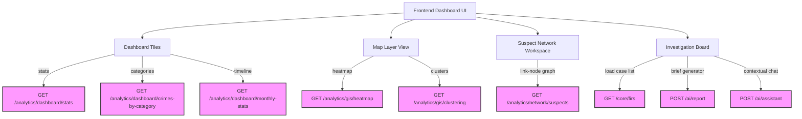

# Frontend Integration Guide (API Gateway Client)

Welcome to the Sentinel AI REST API integration guide. This document is written for frontend developers building the React/UI client layer. It acts as the single source of truth for authenticating, requesting scoped resources, plotting analytics, and querying AI features.

---

## 🔐 1. Authentication & JWT Lifecycle

All REST requests to the core, analytics, and AI endpoints require a valid JSON Web Token (JWT) attached to the request headers.

### Authentication Flow
1. The frontend POSTs credentials to `/auth/login`.
2. The backend validates and returns a JWT `access_token` along with the user's mapped profiles (`role_id`, `district_id`, and `station_id`).
3. The frontend stores this token securely (e.g., in memory or secure context) and attaches it as a Bearer authorization header to all subsequent API calls.

### Attaching the Bearer Token
Include this header in all API requests:
```http
Authorization: Bearer <your_jwt_access_token>
```

### JWT Lifecycle & Expiration
- **Token Expiration**: Access tokens are valid for **30 minutes** (1800 seconds).
- **Expiration Behavior**: Upon expiration, the backend will reject any request with an HTTP status code `401 Unauthorized`. The frontend client must detect this status, clear local session stores, and prompt the user to re-authenticate.

### Expected Authentication Errors
* **401 Unauthorized**:
  * Token is missing, expired, or tampered with.
  * *Response payload:* `{"detail": "Signature has expired."}` or `{"detail": "Could not validate credentials."}`
* **403 Forbidden**:
  * The user is authenticated but does not have the required RBAC role or geographic jurisdiction to view the requested resource.
  * *Response payload:* `{"detail": "Access denied. Insufficient permissions."}`

---

## 👥 2. Role-Based Access Control (RBAC)

The backend enforces strict hierarchical role checks (lower role value = higher authority) combined with geographic scope locks. The frontend must align UI elements and routing restrictions with these roles:

| Role Name | Enum Value | Jurisdiction Scope | Permissions |
| :--- | :---: | :--- | :--- |
| **System Administrator** | `1` | State-wide (Unrestricted) | Full access; only role authorized to delete cases (`DELETE_CASE` & `Permission.MANAGE_USERS`). |
| **State Administrator** | `2` | State-wide (Unrestricted) | Unrestricted read/write of state cases and districts (`VIEW_ALL_DISTRICTS`). |
| **District Superintendent** | `3` | District-wide | Restrained to assigned `district_id`. Accesses district summary, analytics charts, and can manage district users. |
| **Station House Officer (SHO)** | `4` | Station-wide | Restrained to assigned `station_id`. Authorizes case updates and exporting analytical briefs. |
| **Investigating Officer (IO)** | `5` | Station-wide | Restrained to assigned `station_id`. Basic read access and case registration capability (`CREATE_CASE`). |

---

## 🛠️ 3. Rest API Endpoint Catalog

All routes are prefixed by `/api/v1` in production environments (e.g., `http://localhost:8000/api/v1/core/firs`).

---

### Module A: Authentication

#### Login Endpoint
* **HTTP Method**: `POST`
* **Route**: `/auth/login`
* **Purpose**: Authenticate credentials and return session token.
* **Authentication**: None
* **Required Roles**: None
* **Request Body**:
  ```json
  {
    "username": "sho_asha",
    "password": "SecurePassword123!"
  }
  ```
* **Example Curl Request**:
  ```bash
  curl -X POST "http://localhost:8000/auth/login" \
       -H "Content-Type: application/json" \
       -d '{"username": "sho_asha", "password": "SecurePassword123!"}'
  ```
* **Example Successful Response (200 OK)**:
  ```json
  {
    "user": {
      "id": "user-uuid-asha-456",
      "role": 4,
      "district_id": "dist-uuid-karnataka",
      "station_id": "station-uuid-cubbon",
      "is_active": true
    },
    "token": {
      "access_token": "eyJhbGciOiJIUzI1NiIsInR5cCI6IkpXVCJ9...",
      "token_type": "Bearer",
      "expires_in": 1800
    }
  }
  ```
* **Possible Error Responses**:
  * **401 Unauthorized**: Invalid username or password.
  * **403 Forbidden**: User account has been deactivated.

---

### Module B: Core APIs

Note: Response models exclude relationships to prevent serializing circular loops.

#### 1. List FIR Cases
* **HTTP Method**: `GET`
* **Route**: `/core/firs`
* **Purpose**: Retrieve list of cases. Auto-scoped by server to matching district/station claims.
* **Authentication**: Bearer Token Required
* **Required Roles**: Investigating Officer (`5`) or higher.
* **Query Parameters**:
  * `station_id` (Optional string, only usable by District Superintendents or higher to filter stations in scope)
  * `district_id` (Optional string, only usable by State Admins or higher)
  * `status` (Optional string)
  * `severity` (Optional string)
* **Response Body**: Array of FIR records.
* **Example Response (200 OK)**:
  ```json
  [
    {
      "fir_id": "fir-uuid-1",
      "fir_number": "FIR-2026-001",
      "fir_date": "2026-04-10T09:00:00",
      "station_id": "station-uuid-cubbon",
      "district_id": "dist-uuid-karnataka",
      "complainant_name": "Ravi Kumar",
      "complaint_details": "Wallet snatching at park entrance.",
      "investigating_officer_id": "off-uuid-asha",
      "status": "Registered",
      "severity": "Medium"
    }
  ]
  ```

#### 2. Get FIR Details
* **HTTP Method**: `GET`
* **Route**: `/core/firs/{fir_id}`
* **Purpose**: Retrieve case file.
* **Path Parameters**: `fir_id` (string UUID)
* **Response Body**: Single FIR object.
* **Possible Error Responses**:
  * **403 Forbidden**: FIR is outside user's geographic bounds.
  * **404 Not Found**: Case ID does not exist.

#### 3. List Crimes
* **HTTP Method**: `GET`
* **Route**: `/core/crimes`
* **Purpose**: List crimes. Auto-scoped.
* **Response Body**: Array of Crime records.

#### 4. Get Crime Details
* **HTTP Method**: `GET`
* **Route**: `/core/crimes/{crime_id}`
* **Path Parameters**: `crime_id` (string UUID)

#### 5. List Districts
* **HTTP Method**: `GET`
* **Route**: `/core/districts`
* **Purpose**: List available districts. Users with role `3` or lower only receive their own district.

#### 6. Get District Details
* **HTTP Method**: `GET`
* **Route**: `/core/districts/{district_id}`

#### 7. List Officers
* **HTTP Method**: `GET`
* **Route**: `/core/officers`
* **Purpose**: List active police officers. Auto-scoped.

#### 8. Get Officer Details
* **HTTP Method**: `GET`
* **Route**: `/core/officers/{officer_id}`

#### 9. List Evidence
* **HTTP Method**: `GET`
* **Route**: `/core/evidence`
* **Purpose**: List evidence items logged. Auto-scoped.

#### 10. Get Evidence Details
* **HTTP Method**: `GET`
* **Route**: `/core/evidence/{evidence_id}`

---

### Module C: Analytics APIs

Enforces access controls.

#### 1. Caseload Stats Summary
* **HTTP Method**: `GET`
* **Route**: `/analytics/dashboard/stats`
* **Purpose**: Populates metrics tiles.
* **Response Body**:
  ```json
  {
    "total_firs": 24,
    "total_crimes": 31,
    "total_officers": 8,
    "clearance_rate_percent": 87.5,
    "arrest_rate_percent": 68.5
  }
  ```

#### 2. Crimes By District
* **HTTP Method**: `GET`
* **Route**: `/analytics/dashboard/crimes-by-district`
* **Purpose**: Populates bar chart.
* **Response Body**: Array of `{"district_name": str, "crime_count": int}` records.

#### 3. Crimes By Category
* **HTTP Method**: `GET`
* **Route**: `/analytics/dashboard/crimes-by-category`
* **Purpose**: Populates pie charts.
* **Response Body**: Array of `{"category_name": str, "crime_count": int}` records.

#### 4. Monthly Crime Trends
* **HTTP Method**: `GET`
* **Route**: `/analytics/dashboard/monthly-stats`
* **Purpose**: Populates timeline line charts.
* **Response Body**: Array of `{"month": "YYYY-MM-01", "crime_count": int}` records.

#### 5. Officer Case Workload
* **HTTP Method**: `GET`
* **Route**: `/analytics/dashboard/officer-workload`
* **Purpose**: Populates caseload bar charts.
* **Response Body**: Array of `{"officer_name": str, "assigned_firs": int}` records.

#### 6. GIS Density Heatmap
* **HTTP Method**: `GET`
* **Route**: `/analytics/gis/heatmap`
* **Purpose**: Renders GIS boundary density layers on map view.
* **Response Body**: Array of `{"district_name": str, "boundary_geojson": GeoJSON_str, "firs": int}` records.

#### 7. GIS Crime Point Clustering
* **HTTP Method**: `GET`
* **Route**: `/analytics/gis/clustering`
* **Purpose**: Renders coordinate pins grouped by police station.
* **Response Body**: Array of `{"station_name": str, "latitude": float, "longitude": float, "fir_count": int}` records.

#### 8. Suspect Association Network
* **HTTP Method**: `GET`
* **Route**: `/analytics/network/suspects`
* **Purpose**: Renders suspect relationship link-node graphs.
* **Response Body**:
  ```json
  {
    "nodes": [
      {"id": "s1", "label": "John Doe", "gender": "Male", "status": "Active"}
    ],
    "edges": [
      {"source": "s1", "target": "s2", "relationship": "Co-conspirator", "notes": "Observed together"}
    ]
  }
  ```

#### 9. Global Keyword Search
* **HTTP Method**: `GET`
* **Route**: `/analytics/search`
* **Purpose**: Populates search result sections.
* **Query Parameters**: `q` (Search query string, minimum 1 character)
* **Response Body**:
  ```json
  {
    "firs": [{"fir_id": "...", "fir_number": "...", "complainant_name": "...", "status": "..."}],
    "crimes": [{"crime_id": "...", "fir_number": "...", "severity": "...", "crime_description": "..."}],
    "suspects": [{"suspect_id": "...", "full_name": "...", "gender": "...", "status": "..."}],
    "officers": [{"officer_id": "...", "full_name": "...", "badge_number": "...", "rank": "..."}]
  }
  ```

---

### Module D: AI APIs

#### 1. Parse Image OCR
* **HTTP Method**: `POST`
* **Route**: `/ai/ocr`
* **Purpose**: Extract text from documents.
* **Request Body**:
  ```json
  {
    "image_path": "datasets/raw/images/sample_fir.jpg"
  }
  ```
* **Response Body**:
  ```json
  {
    "image_path": "datasets/raw/images/sample_fir.jpg",
    "extracted_text": "Extracted text content..."
  }
  ```

#### 2. Chat Assistant
* **HTTP Method**: `POST`
* **Route**: `/ai/assistant`
* **Purpose**: Interactive chat about cases in current jurisdiction.
* **Request Body**:
  ```json
  {
    "question": "Give me a summary of open cases."
  }
  ```
* **Response Body**:
  ```json
  {
    "question": "Give me a summary of open cases.",
    "response": "Detailed contextualized markdown response."
  }
  ```

#### 3. Generate Brief Report
* **HTTP Method**: `POST`
* **Route**: `/ai/report`
* **Purpose**: Generates investigative briefs.
* **Request Body**:
  ```json
  {
    "fir_id": "fir-uuid-value"
  }
  ```
* **Response Body**:
  ```json
  {
    "fir_id": "fir-uuid-value",
    "report": "# Formatted Markdown Case Report..."
  }
  ```

---

## 🗺️ 4. Frontend Workspace Mapping

Use this guide to map specific UI components to their endpoints:



---

## 💡 5. Best Integration Practices

1. **Never Decode JWTs Manually for Permissions**:
   * Do not write client-side logic that parses the JWT claims to block or allow features. The backend is the sole authority for RBAC validation.
2. **Treat API Responses as the Single Source of Truth**:
   * Scoping and filtering calculations are executed in the database layer. Use the responses directly to populate components without attempting client-side data subsets.
3. **Never Make UI Layouts Dependent on Schema Details**:
   * Rely entirely on the API contract payloads. The backend abstracts complex relational model joins (e.g. mapping `User` profiles to `Officer` records) so the client stays isolated from raw database shapes.
