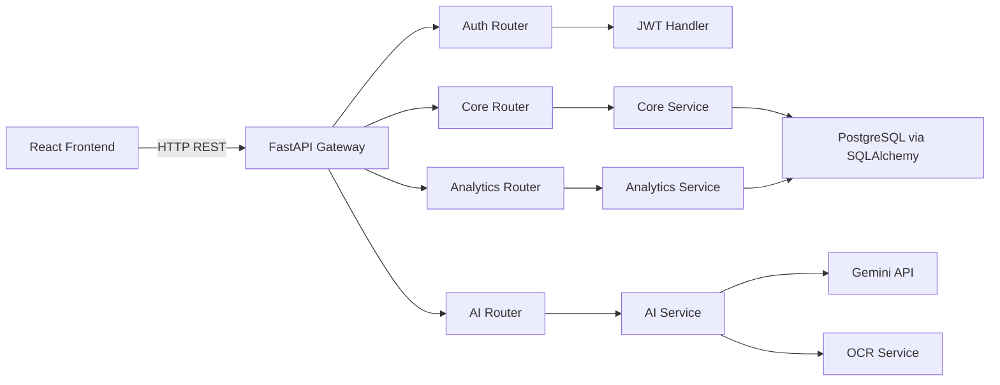
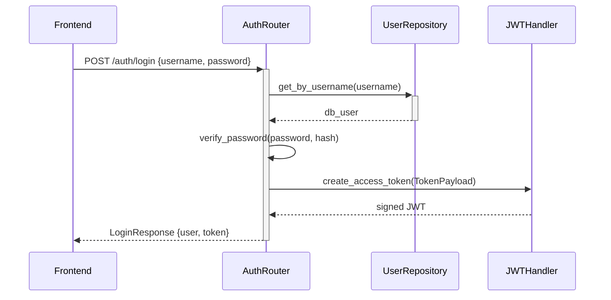

# Sentinel AI

## Backend Module

> FastAPI-powered REST API providing case management, authentication, analytics, and AI intelligence services for the Sentinel AI crime intelligence operating system.

[](https://www.python.org/)
[](https://fastapi.tiangolo.com/)
[](https://www.postgresql.org/)
[](https://jwt.io/)
[](https://www.sqlalchemy.org/)

Sentinel AI is an AI-powered crime intelligence operating system. This branch contains the backend services that provide the REST API layer consumed by the React frontend. It handles officer authentication, jurisdiction-scoped data access, analytics, AI integrations, and database interactions.

This README documents the Backend branch only. It intentionally excludes frontend rendering and data pipeline details.

---

## Project Objectives

The backend is designed to:

- Authenticate officers and issue JWT access tokens with role-based scope.
- Enforce geographic access control so officers see only their jurisdiction's records.
- Expose CRUD APIs for FIRs, crimes, suspects, evidence, officers, and diary entries.
- Serve analytics, KPIs, trend data, and cross-district search results.
- Coordinate Google Gemini AI for OCR, conversational assistance, and report generation.
- Interface with PostgreSQL via SQLAlchemy ORM and repositories.
- Provide a documented interactive API surface via OpenAPI.

## Problem Statement

Crime investigation systems require multi-level access control so that an officer at a police station cannot access case records from another district. At the same time, administrators need cross-district visibility. Without a structured API layer, these rules are difficult to enforce consistently.

The Backend module solves this by implementing a scoped service layer that applies role-based geographic filters to every query, ensuring that data visibility is determined by the officer's role, district, and station assignments.

## Why This Module Exists

The backend module provides:

- A single, typed REST API surface consumed by the React frontend.
- A consistent data access pattern using SQLAlchemy repositories.
- A role-aware service layer that guarantees data isolation without per-endpoint if-conditions.
- Decoupled AI integrations that can be swapped or extended without changing route contracts.

---

## 1. Architecture Overview



### Processing stages

| Stage | Component | Responsibility | Output |
|---|---|---|---|
| Authenticate | `auth/router.py` | Validate credentials and issue JWT | Bearer token |
| Authorise | `auth/dependencies.py` | Validate token and load user scope | `CurrentUser` |
| Serve | `core/router.py` | Route requests to the service layer | JSON responses |
| Compute | `core/service.py` | Apply scoping rules and query the ORM | ORM result sets |
| Persist | `database/repositories.py` | Execute typed database queries | ORM model instances |
| Analyse | `analytics/service.py` | Aggregate KPIs, trends, and search | Aggregated JSON |
| Reason | `ai/service.py` | Coordinate Gemini and OCR calls | AI text responses |

---

## 2. Repository Structure

```text
backend/
├── auth/
│   ├── __init__.py              # Module exports
│   ├── router.py                # Login endpoint
│   ├── dependencies.py          # JWT validation and user-loading dependency
│   ├── jwt_handler.py           # Token creation and decoding
│   ├── models.py                # CurrentUser, LoginRequest, TokenResponse Pydantic models
│   ├── password.py              # bcrypt password hashing and verification
│   ├── permissions.py           # Role-to-scope mapping and access predicates
│   ├── role_mapper.py           # DB user → CurrentUser mapper
│   └── exceptions.py            # Auth-specific exception classes
├── core/
│   ├── router.py                # FIR, crime, suspect, evidence, officer, diary endpoints
│   └── service.py               # Business logic and ORM query orchestration
├── analytics/
│   ├── router.py                # Analytics and search endpoints
│   └── service.py               # KPI, trend, district, and search logic
├── ai/
│   ├── router.py                # OCR, assistant, report, translate endpoints
│   └── service.py               # Gemini and OCR coordination
├── config/
│   ├── lookup/                  # Domain lookup values for data generation
│   └── system.py                # Backend-level configuration constants
├── scripts/                     # Data pipeline (see data branch README)
│   ├── generators/              # Synthetic data generators
│   ├── pipeline/                # Dataset pipeline orchestration
│   ├── validation/              # Validation engine
│   └── database/                # PostgreSQL loader and Neo4j exporter
├── data/
│   └── generated/               # Generated CSV datasets
└── main.py                      # FastAPI application factory and router registration
```

---

## 3. Authentication Module

`backend/auth/` implements the full authentication and authorisation lifecycle.

### Login flow



### Token payload

```json
{
  "sub": "officer_uuid",
  "role_id": 2,
  "district_id": "district_uuid",
  "station_id": "station_uuid",
  "exp": 1234567890
}
```

### Role hierarchy

| Role | Numeric ID | Scope |
|---|---|---|
| `SUPERADMIN` | 1 | All districts and all stations |
| `ADMIN` | 2 | All stations within assigned district |
| `OFFICER` | 3 | Own police station only |

### Error responses

| HTTP Code | Condition |
|---|---|
| `401 Unauthorized` | Invalid credentials, expired token, or missing token |
| `403 Forbidden` | Inactive account or insufficient role |

---

## 4. Core Module

`backend/core/` exposes the primary operational CRUD surface.

### FIR endpoints

| Method | Endpoint | Description |
|---|---|---|
| `GET` | `/core/firs` | List FIRs visible to the current user |
| `POST` | `/core/firs` | Register a new FIR |
| `GET` | `/core/firs/{fir_id}` | Retrieve a specific FIR with enriched fields |

Query parameters for `GET /core/firs`:

| Parameter | Type | Description |
|---|---|---|
| `station_id` | string | Filter by police station |
| `district_id` | string | Filter by district |
| `status` | string | Filter by FIR status |
| `severity` | string | Filter by severity level |

FIR responses include enriched fields:

- `district_name` — resolved district name from the joined district table.
- `station_name` — resolved station name from the joined station table.
- `officer_name` — assigned officer full name from the joined officer table.

### Crime endpoints

| Method | Endpoint | Description |
|---|---|---|
| `GET` | `/core/crimes` | List crimes in user scope |
| `GET` | `/core/crimes/{crime_id}` | Retrieve a specific crime record |

### Evidence endpoints

| Method | Endpoint | Description |
|---|---|---|
| `GET` | `/core/evidence` | List evidence items in user scope |
| `GET` | `/core/evidence/{evidence_id}` | Retrieve a specific evidence record |

### Officer endpoints

| Method | Endpoint | Description |
|---|---|---|
| `GET` | `/core/officers` | List officers in user jurisdiction |
| `GET` | `/core/officers/{officer_id}` | Retrieve a specific officer profile |

### District endpoints

| Method | Endpoint | Description |
|---|---|---|
| `GET` | `/core/districts` | List accessible districts |
| `GET` | `/core/districts/{district_id}` | Retrieve specific district metadata |

### Entity resolver

| Method | Endpoint | Description |
|---|---|---|
| `GET` | `/core/entities` | Resolve suspect, vehicle, and victim for a FIR |

### Investigation diary endpoints

| Method | Endpoint | Description |
|---|---|---|
| `POST` | `/core/diary` | Add a new diary entry linked to an FIR |
| `GET` | `/core/diary` | Retrieve past diary entries for the current officer |

---

## 5. Analytics Module

`backend/analytics/` provides aggregated intelligence for the dashboard and analytics screens.

### Analytics endpoints

| Method | Endpoint | Description |
|---|---|---|
| `GET` | `/analytics/kpis` | Summary KPI counts for dashboard tiles |
| `GET` | `/analytics/trends` | Crime trend data over time |
| `GET` | `/analytics/district-stats` | Per-district crime breakdown |
| `GET` | `/analytics/search` | Cross-entity keyword search |
| `GET` | `/analytics/crime-statistics` | Crime category distribution |

### KPI fields returned

- Total FIR count in scope.
- Active cases count.
- Resolved cases count.
- Suspect count.
- Evidence count.
- Officer count.

---

## 6. AI Module

`backend/ai/` coordinates Google Gemini and OCR services.

### AI endpoints

| Method | Endpoint | Description |
|---|---|---|
| `POST` | `/ai/ocr` | Extract text from image (Tesseract + Gemini fallback) |
| `POST` | `/ai/assistant` | Natural-language case query assistant |
| `POST` | `/ai/report` | Generate structured investigative brief |
| `POST` | `/ai/translate` | Translate text to a target language |
| `POST` | `/ai/analyze-digital-evidence` | Analyse digital evidence metadata |
| `POST` | `/ai/voice-search` | Transcribe audio and execute case search |
| `POST` | `/ai/pattern-similarity` | Find cases with similar crime patterns |

### OCR strategy

1. Attempt local text extraction using `pytesseract`.
2. If Tesseract fails, open the image and send it to the Gemini multimodal API with an OCR prompt.
3. Return the extracted text or raise a detailed 500 error if both methods fail.

### AI assistant context loading

When a user queries the assistant:

1. Load the user's scoped FIR list using `core_service.get_firs()`.
2. Build a structured context string from up to 15 recent FIRs.
3. Inject the context into the Gemini system prompt alongside the user's question.
4. Return the Gemini response as plain text.

### Investigative report sections

Reports generated by `POST /ai/report` include:

1. Executive Summary and Case Status
2. Complainant Allegations and Incident Description
3. Offense Breakdown and Modus Operandi Analysis
4. Suspect Profiles and Network Intelligence
5. Evidence Chain of Custody and Physical Assets
6. Recommended Next Steps

---

## 7. Database Layer

The database layer is in the `database/` directory at the project root.

### Key files

| File | Responsibility |
|---|---|
| `models.py` | SQLAlchemy ORM models for all entities |
| `connection.py` | Session factory and `get_db` dependency |
| `repositories.py` | Repository classes with typed data access methods |
| `queries.py` | Custom aggregate and cross-table query functions |
| `bulk_loader.py` | Bulk data loading utilities for seeding |
| `integration.py` | Database health check and connectivity test |

### Primary ORM models

| Model | Table | Key fields |
|---|---|---|
| `User` | `users` | `user_id`, `username`, `password_hash`, `role_id`, `is_active` |
| `Officer` | `officers` | `officer_id`, `full_name`, `badge_number`, `rank`, `station_id` |
| `District` | `districts` | `district_id`, `district_name` |
| `PoliceStation` | `police_stations` | `station_id`, `station_name`, `district_id` |
| `FIR` | `firs` | `fir_id`, `fir_number`, `fir_date`, `status`, `severity`, `district_id`, `station_id` |
| `Crime` | `crimes` | `crime_id`, `fir_id`, `category_id`, `crime_description`, `modus_operandi` |
| `Suspect` | `suspects` | `suspect_id`, `full_name`, `gender`, `status` |
| `Victim` | `victims` | `victim_id`, `full_name`, `contact_number` |
| `Evidence` | `evidence` | `evidence_id`, `evidence_type`, `description`, `storage_location` |
| `Vehicle` | `vehicles` | `vehicle_id`, `registration_number`, `make`, `model` |
| `ActivityLog` | `activity_logs` | `activity_log_id`, `user_id`, `entity_type`, `action`, `details` |

---

## 8. Execution Guide

### Requirements

- Python 3.11 or newer.
- PostgreSQL 15 or a compatible managed PostgreSQL service.
- Google Gemini API key.

### Create a virtual environment

```bash
python -m venv .venv
source .venv/bin/activate
```

On Windows PowerShell:

```powershell
python -m venv .venv
.\.venv\Scripts\Activate.ps1
```

### Install dependencies

```bash
pip install -r requirements.txt
```

### Run the backend server

```bash
uvicorn backend.main:app --reload
```

The API is available at `http://localhost:8000`.

Interactive API documentation: `http://localhost:8000/docs`

OpenAPI schema: `http://localhost:8000/openapi.json`

### Run database migrations

```bash
alembic upgrade head
```

### Health check

```bash
curl http://localhost:8000/
```

Expected response:

```json
{"status": "healthy", "service": "Sentinel AI API Gateway"}
```

---

## 9. Environment Variables

Create a local `.env` file from `.env.example`.

```env
POSTGRES_HOST=localhost
POSTGRES_PORT=5432
POSTGRES_DATABASE=sentinel_ai
POSTGRES_USER=sentinel_user
POSTGRES_PASSWORD=change_me
POSTGRES_SSLMODE=require

GEMINI_API_KEY=your_gemini_api_key

JWT_SECRET_KEY=your_jwt_secret
JWT_ALGORITHM=HS256
ACCESS_TOKEN_EXPIRE_MINUTES=480
```

| Variable | Purpose |
|---|---|
| `POSTGRES_HOST` | PostgreSQL hostname |
| `POSTGRES_PORT` | PostgreSQL port |
| `POSTGRES_DATABASE` | Target database name |
| `POSTGRES_USER` | Database user |
| `POSTGRES_PASSWORD` | Database password |
| `POSTGRES_SSLMODE` | PostgreSQL transport mode |
| `GEMINI_API_KEY` | Google Gemini API key |
| `JWT_SECRET_KEY` | JWT signing secret |
| `JWT_ALGORITHM` | JWT algorithm, typically `HS256` |
| `ACCESS_TOKEN_EXPIRE_MINUTES` | Token lifetime in minutes |

Credentials are loaded at runtime and must remain outside version control. Never add real passwords, API keys, or connection strings to Git.

---

## 10. Generated Output

Running the backend produces:

- A live FastAPI application exposing all API routes.
- JWT tokens issued on successful officer login.
- Role-scoped JSON responses for all data queries.
- AI-generated text for OCR, assistance, reports, and translations.
- Activity log entries for diary and audit operations.

---

## 11. Achievements

- Implemented a JWT authentication system with bcrypt password verification.
- Designed a three-tier RBAC system with geographic scope enforcement.
- Built a fully typed service layer separating route contracts from business logic.
- Integrated Google Gemini AI into OCR, assistant, report, and translation workflows.
- Implemented a repository pattern for consistent data access.
- Exposed 20+ REST endpoints covering the full crime intelligence operational surface.
- Implemented scoped search and aggregated analytics queries.

---

## 12. Future Improvements

- Add real-time case alerts using WebSockets.
- Add rate limiting and API key management for external consumers.
- Implement full-text search using PostgreSQL `tsvector` or Elasticsearch.
- Add structured audit logs for every data mutation.
- Add a testing suite with pytest and HTTP test client coverage.
- Add OpenAPI response schema definitions for all endpoints.
- Implement refresh token rotation alongside access token expiry.
- Add geographic filtering to analytics endpoints for district-level drill-down.

---

## 13. Technology Stack

| Technology | Use |
|---|---|
| Python | Primary backend language |
| FastAPI | REST API framework and OpenAPI documentation |
| SQLAlchemy | ORM and database abstraction |
| Alembic | Database migration management |
| PostgreSQL | Relational data persistence |
| Pydantic | Request validation and settings management |
| python-dotenv | Runtime environment configuration |
| PyJWT | JWT creation and validation |
| bcrypt | Password hashing |
| Google Gemini | AI assistant, OCR fallback, and report generation |
| pytesseract | Primary OCR engine |
| Pillow | Image loading for OCR processing |
| Loguru | Structured logging |
| Pandas | Data handling in the pipeline module |

---

## 14. Contributors

| Role | Contributor |
|---|---|
| Backend Architecture | `<name>` |
| Authentication Engineering | `<name>` |
| Database Engineering | `<name>` |
| AI Integration | `<name>` |
| QA and Testing | `<name>` |
| Technical Documentation | `<name>` |

---

## License and Data Safety

This branch handles operational case management APIs. Never place real case data, officer credentials, or production connection strings in commits, issues, or documentation. Use the synthetic data pipeline for safe development and QA.

---

## Status

```text
FastAPI application  : Operational
Authentication       : JWT + RBAC — operational
Core APIs            : FIR, crime, evidence, officers — operational
Analytics APIs       : KPIs, trends, search — operational
AI APIs              : Gemini OCR, assistant, reports — operational
PostgreSQL           : Connected when credentials are configured
API docs             : http://localhost:8000/docs
```
