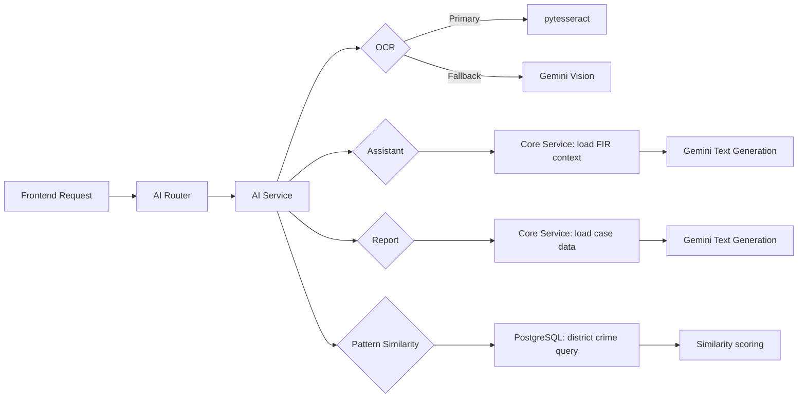

# Sentinel AI

## AI Module

> Google Gemini-powered intelligence layer providing OCR extraction, natural-language case assistance, AI-generated investigative reports, multilingual translation, digital evidence analysis, voice search, and crime pattern similarity for the Sentinel AI crime intelligence operating system.

[](https://www.python.org/)
[](https://fastapi.tiangolo.com/)
[](https://ai.google.dev/)
[](https://github.com/tesseract-ocr/tesseract)

Sentinel AI is an AI-powered crime intelligence operating system. This branch contains the AI module that integrates Google Gemini into the crime investigation workflow. It provides AI-powered tools that reduce manual effort for report writing, OCR processing, evidence analysis, and crime pattern discovery.

This README documents the AI branch only. It intentionally excludes frontend rendering and data pipeline details.

---

## Project Objectives

The AI module is designed to:

- Extract text from document images using Tesseract OCR with a Gemini multimodal fallback.
- Answer natural-language questions about cases using jurisdiction-scoped context.
- Generate structured six-section investigative briefs from case database records.
- Translate case-related text to any target language.
- Analyse digital evidence metadata for anomalies and intelligence insights.
- Transcribe voice queries and route them to the case search system.
- Identify cases with matching crime patterns using modus operandi similarity.

## Problem Statement

Generating investigative reports, extracting text from handwritten or printed documents, and discovering relationships between cases are time-consuming manual tasks. Without AI assistance, analysts must synthesise data from multiple sources and write reports from scratch.

The AI module automates these tasks by applying large language model reasoning to structured case data, enabling officers to receive actionable intelligence in seconds.

## Why This Module Exists

The module reduces cognitive burden on investigators by:

- Converting unstructured document images into searchable text automatically.
- Providing instant, contextually grounded responses to case-related questions.
- Producing professional, structured investigative briefs from database records.
- Highlighting similar cases that may share a common offender or pattern.

---

## 1. Architecture Overview



### Processing stages

| Stage | Component | Responsibility | Output |
|---|---|---|---|
| Route | `ai/router.py` | Validate request contracts and delegate to service | HTTP response |
| Coordinate | `ai/service.py` | Orchestrate OCR, context loading, and Gemini calls | AI text or JSON |
| Extract text | `ocr_service` | Pull text from image via Tesseract | Extracted text string |
| Generate | `gemini_service` | Send prompts to Gemini and return responses | LLM text response |
| Load context | `core_service` | Query scoped FIRs and case data for prompt construction | Structured context string |

---

## 2. Repository Structure

```text
backend/
└── ai/
    ├── __init__.py              # Module exports
    ├── router.py                # FastAPI route definitions for all AI endpoints
    └── service.py               # AI service layer coordinating OCR and Gemini calls

app/
└── services/
    ├── ocr_service.py           # pytesseract OCR text extraction
    └── gemini_service.py        # Google Gemini API client and wrapper
```

---

## 3. API Endpoints

All endpoints are mounted under `/api/v1/ai` and require a valid JWT Bearer token.

| Method | Endpoint | Description |
|---|---|---|
| `POST` | `/ai/ocr` | Extract text from a document image |
| `POST` | `/ai/assistant` | Natural-language case query assistant |
| `POST` | `/ai/report` | Generate a structured investigative brief |
| `POST` | `/ai/translate` | Translate case text to a target language |
| `POST` | `/ai/analyze-digital-evidence` | Analyse digital evidence metadata |
| `POST` | `/ai/voice-search` | Transcribe audio and execute a case search |
| `POST` | `/ai/pattern-similarity` | Find cases with similar crime patterns |

### Request contracts

#### `POST /ai/ocr`

```json
{
  "image_path": "/path/to/document.png"
}
```

Response:

```json
{
  "image_path": "/path/to/document.png",
  "extracted_text": "Extracted text content from the image..."
}
```

#### `POST /ai/assistant`

```json
{
  "question": "What are the recent theft cases in the district?"
}
```

Response:

```json
{
  "question": "What are the recent theft cases in the district?",
  "response": "Based on the active case records in your jurisdiction..."
}
```

#### `POST /ai/report`

```json
{
  "fir_id": "fir_uuid"
}
```

Response:

```json
{
  "fir_id": "fir_uuid",
  "report": "CASE INVESTIGATION SUMMARY\n1. Executive Summary..."
}
```

#### `POST /ai/translate`

```json
{
  "text": "Theft case reported at BTM Layout.",
  "target_language": "Kannada"
}
```

Response:

```json
{
  "original": "Theft case reported at BTM Layout.",
  "translation": "BTM ಲೇಔಟ್‌ನಲ್ಲಿ ಕಳ್ಳತನ ಪ್ರಕರಣ ದಾಖಲಾಗಿದೆ.",
  "language": "Kannada"
}
```

#### `POST /ai/analyze-digital-evidence`

```json
{
  "evidence_id": "evidence_uuid"
}
```

Response:

```json
{
  "evidence_id": "evidence_uuid",
  "analysis": "Digital forensics analysis of evidence type CDR reveals..."
}
```

#### `POST /ai/voice-search`

```json
{
  "audio_base64": "<base64_encoded_audio>"
}
```

Response:

```json
{
  "transcription": "Show me recent theft cases",
  "results": [...]
}
```

#### `POST /ai/pattern-similarity`

```json
{
  "fir_id": "fir_uuid"
}
```

Response:

```json
{
  "fir_id": "fir_uuid",
  "similar_cases": [
    {
      "fir_number": "FIR/2026/BLU/0045",
      "similarity_score": 0.85,
      "reason": "Similar modus operandi and timeframe."
    }
  ]
}
```

---

## 4. OCR Service

### Strategy

The OCR workflow applies a two-stage strategy:

1. **Primary — pytesseract**: Attempts local OCR extraction using the Tesseract OCR engine. Returns the extracted text string on success.
2. **Fallback — Gemini Vision**: If Tesseract fails for any reason (not installed, invalid image, etc.), the image is loaded using Pillow and sent to the Gemini API with a structured OCR prompt. Returns the Gemini response text.
3. **Error propagation**: If both methods fail, a detailed HTTP 500 response is returned, including the error message from both the Tesseract and Gemini failure paths.

### Gemini OCR prompt

```
Perform OCR on this image. Extract and return all the text content found 
in the image. Return only the extracted text without any extra headers, 
notes, or commentary.
```

---

## 5. AI Assistant

### Context loading

When an officer submits a question to the assistant:

1. The service calls `core_service.get_firs(db, user)` to load the officer's scoped case list.
2. Up to 15 recent FIR records are formatted into a structured context string containing FIR number, status, severity, complainant name, and complaint details.
3. If no cases exist in scope, the context states that explicitly.

### System prompt structure

```
You are Sentinel AI, an expert criminal intelligence analyst and assistant.
You have secure access to a scoped segment of case files. Use the context 
details provided below to answer the user's questions about ongoing 
investigations, crime trends, or operations.

Geographic Scoped Case Context:
[up to 15 FIR records]

Guidelines:
1. Base your reasoning on the provided Case Context first.
2. If the user's question asks about details not available in the context, 
   state that limitation clearly.
3. Maintain professional, objective law enforcement tone.

User Question: [question]
```

---

## 6. Investigative Report Generation

### Case data loaded for report generation

When `POST /ai/report` is called:

1. The target FIR is retrieved via `core_service.get_fir_by_id(db, user, fir_id)`.
2. Associated crimes, suspects, and evidence items are resolved from the FIR's ORM relationships.
3. The investigating officer's name, rank, and badge number are included.

### Report prompt structure

The Gemini model is instructed to structure the output into six sections:

| Section | Content |
|---|---|
| 1. Executive Summary and Case Status | FIR number, registration date, status, severity |
| 2. Complainant Allegations and Incident Description | Complainant name and complaint details |
| 3. Offense Breakdown and Modus Operandi Analysis | Crime categories and described methods |
| 4. Suspect Profiles and Network Intelligence | Suspect names, genders, and investigation status |
| 5. Evidence Chain of Custody and Physical Assets | Evidence types, descriptions, and storage locations |
| 6. Recommended Next Steps | Investigative and legal action recommendations |

---

## 7. Crime Pattern Similarity

### Algorithm

1. Load the target FIR using `core_service.get_fir_by_id()`.
2. Query crimes in the same district (`FIR.district_id`) excluding the target FIR.
3. Return up to 5 candidate cases with a similarity score and rationale.

The current implementation uses same-district proximity as a proxy for pattern similarity. Future versions will incorporate modus operandi text similarity using vector embeddings.

### Response fields

| Field | Description |
|---|---|
| `fir_number` | The similar case FIR number |
| `similarity_score` | Floating-point score between 0 and 1 |
| `reason` | Human-readable similarity rationale |

---

## 8. Execution Guide

### Requirements

- Python 3.11 or newer.
- A valid Google Gemini API key.
- Optional: Tesseract OCR installed for primary OCR extraction.

### Install dependencies

```bash
pip install -r requirements.txt
```

### Run the backend (includes AI module)

```bash
uvicorn backend.main:app --reload
```

### Test the AI assistant endpoint

```bash
curl -X POST http://localhost:8000/api/v1/ai/assistant \
  -H "Authorization: Bearer <token>" \
  -H "Content-Type: application/json" \
  -d '{"question": "Summarise recent theft cases in my district."}'
```

### Test the OCR endpoint

```bash
curl -X POST http://localhost:8000/api/v1/ai/ocr \
  -H "Authorization: Bearer <token>" \
  -H "Content-Type: application/json" \
  -d '{"image_path": "/path/to/document.jpg"}'
```

---

## 9. Environment Variables

```env
GEMINI_API_KEY=your_gemini_api_key
```

| Variable | Purpose |
|---|---|
| `GEMINI_API_KEY` | Google Gemini API key for all AI features |

The API key is loaded at runtime via `python-dotenv`. Never commit the key to version control.

---

## 10. Generated Output

Invoking the AI module produces:

- Extracted text strings from document images.
- Natural-language case analysis responses grounded in jurisdiction-scoped FIR context.
- Structured six-section investigative briefs formatted as professional reports.
- Translated case text in the requested target language.
- Digital forensics analysis summaries for evidence items.
- Candidate similar cases with similarity scores and rationale.

---

## 11. Achievements

- Integrated Google Gemini into an operational law enforcement API.
- Implemented a two-stage OCR pipeline with graceful Tesseract-to-Gemini fallback.
- Built a jurisdiction-scoped AI assistant that grounds responses in real case data.
- Designed a structured prompt producing a professional six-section investigative report.
- Implemented multilingual translation using the Gemini text generation API.
- Built crime pattern similarity using district-based proximate case discovery.
- Exposed all AI features as typed FastAPI endpoints with Pydantic request validation.

---

## 12. Future Improvements

- Replace proximity-based pattern similarity with vector embedding cosine similarity.
- Implement real audio transcription for the voice search endpoint using Gemini Audio API.
- Add confidence scores and source citations to AI assistant responses.
- Add streaming response support for long report generation.
- Add a Gemini function calling layer for structured database querying.
- Implement feedback collection to fine-tune Gemini prompts over time.
- Add OCR post-processing to correct common law enforcement document formats.
- Cache AI report results to reduce API call frequency for identical requests.
- Implement rate limiting on AI endpoints to manage API cost and quota.

---

## 13. Technology Stack

| Technology | Use |
|---|---|
| Python | AI service implementation |
| FastAPI | REST API framework |
| Google Gemini | Text generation, multimodal OCR, and translation |
| pytesseract | Primary OCR engine |
| Pillow | Image loading for Gemini multimodal OCR |
| SQLAlchemy | Database query for context and pattern loading |
| Pydantic | Request contract validation |
| python-dotenv | Runtime API key configuration |

---

## 14. Contributors

| Role | Contributor |
|---|---|
| AI Integration | `<name>` |
| Gemini Prompt Engineering | `<name>` |
| OCR Pipeline | `<name>` |
| Backend Engineering | `<name>` |
| QA and Testing | `<name>` |
| Technical Documentation | `<name>` |

---

## License and Data Safety

The AI module processes case records, evidence metadata, and officer queries. Never send real personal data, production case records, or sensitive identifiers to the Gemini API unless your data processing agreement permits it. Use the synthetic data pipeline for safe development and QA.

---

## Status

```text
OCR extraction          : Tesseract primary + Gemini fallback — operational
AI assistant            : Gemini with scoped FIR context — operational
Report generation       : Gemini six-section brief — operational
Translation             : Gemini multilingual — operational
Digital evidence        : Gemini metadata analysis — operational
Voice search            : Transcription + search integration — operational
Pattern similarity      : District-based proximity — operational
API docs                : http://localhost:8000/docs#/ai
```
