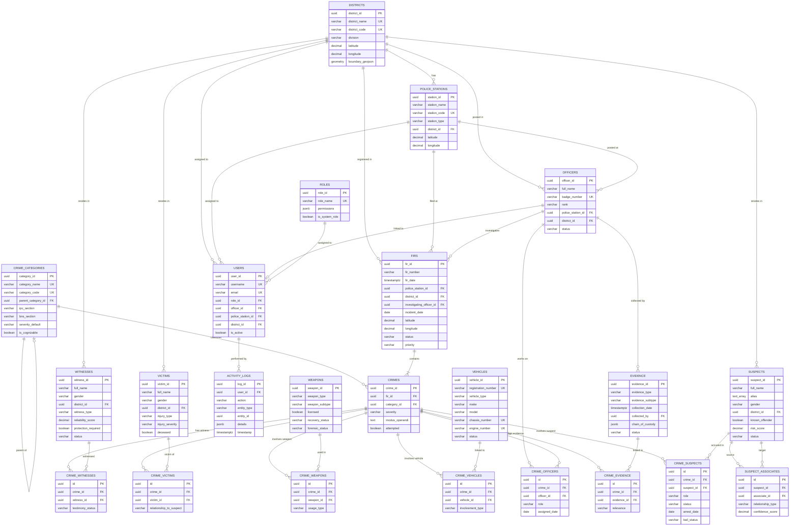
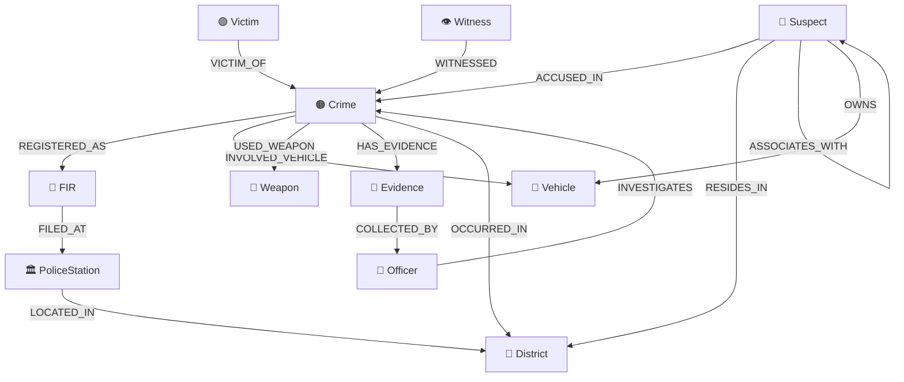

# 🛡️ Sentinel AI — Sprint 1 Design Document

## Data Foundation & Architecture Blueprint

> **Project**: Sentinel AI — AI Powered Crime Intelligence Operating System
> **Client**: Karnataka State Police (KSP)
> **Sprint**: 1 of 10
> **Owner**: Data & Intelligence Lead
> **Branch**: `data`
> **Status**: Design Review

---

## 1. Project Overview

Sentinel AI is an AI-powered Crime Intelligence Operating System being developed for Karnataka State Police. The platform transforms fragmented crime records into actionable intelligence using data engineering, analytics, GIS, graph databases, machine learning, and generative AI.

This document is the **Sprint 1 deliverable** — the complete data foundation blueprint. Every table, column, relationship, and data flow defined here becomes the single source of truth for all four team members (Backend, Frontend, AI, Data & Intelligence).

### What This Document Covers

| # | Section | Purpose |
|---|---------|---------|
| 1 | Folder Architecture | Production-ready project structure |
| 2 | Dataset Design | All 15 datasets with purpose, owner, and relationships |
| 3 | Data Dictionary | Every column, type, constraint, and example value |
| 4 | ER Diagram | Complete PostgreSQL entity relationships |
| 5 | PostgreSQL Schema Design | Table design, indexes, partitioning — no SQL |
| 6 | Neo4j Knowledge Graph | Nodes, relationships, query patterns — no Cypher |
| 7 | GIS Data Model | Spatial layers, coordinate specs, heatmap inputs |
| 8 | Analytics Design | KPIs, metrics, dashboard data requirements |
| 9 | Integration Requirements | What Backend, Frontend, and AI need from Data |
| 10 | Sprint Roadmap | Sprints 2–10 overview |

### What This Document Does NOT Cover

- No Python code
- No ETL pipelines
- No SQL scripts
- No CSV or synthetic datasets
- No ML models
- No dashboards or API code
- No Neo4j or GIS implementation

Sprint 1 is architecture and design only.

---

## 2. Production Folder Architecture

```
data/
│
├── datasets/                               # ── Data Storage (gitignored) ──
│   ├── raw/                                # Original unprocessed files
│   │   ├── firs/
│   │   ├── crimes/
│   │   ├── crime_categories/
│   │   ├── suspects/
│   │   ├── victims/
│   │   ├── witnesses/
│   │   ├── officers/
│   │   ├── vehicles/
│   │   ├── weapons/
│   │   ├── evidence/
│   │   ├── police_stations/
│   │   └── districts/
│   │
│   ├── cleaned/                            # Post-cleaning output
│   │   └── (mirrors raw/ structure)
│   │
│   ├── processed/                          # Feature-engineered, analysis-ready
│   │   └── (mirrors raw/ structure)
│   │
│   └── exports/                            # Module-specific outputs
│       ├── analytics/                      # Aggregated KPIs, trend data
│       ├── gis/                            # GeoJSON, heatmap grids
│       │   ├── boundaries/
│       │   ├── points/
│       │   └── heatmaps/
│       ├── graph/                          # Neo4j import/export CSVs
│       │   ├── nodes/
│       │   └── relationships/
│       └── reports/                        # Generated investigation reports
│
├── etl/                                    # ── ETL Pipeline Code ──
│   ├── __init__.py
│   ├── extract.py                          # Data extraction from sources
│   ├── transform.py                        # Cleaning, standardization
│   ├── load.py                             # Load into PostgreSQL/Neo4j
│   ├── validate.py                         # Data quality checks
│   └── pipeline.py                         # Orchestrator
│
├── analytics/                              # ── Analytics Modules ──
│   ├── __init__.py
│   ├── crime_statistics.py                 # Aggregate crime stats
│   ├── trend_analysis.py                   # Temporal trends
│   ├── district_analysis.py                # District-level comparisons
│   └── kpi_engine.py                       # Dashboard KPI computation
│
├── gis/                                    # ── GIS Modules ──
│   ├── __init__.py
│   ├── geocoder.py                         # Address → lat/lng
│   ├── heatmap.py                          # Crime heatmap generation
│   ├── clustering.py                       # DBSCAN/HDBSCAN hotspots
│   └── timeline.py                         # Temporal-spatial animation
│
├── neo4j/                                  # ── Neo4j Graph Modules ──
│   ├── __init__.py
│   ├── schema.py                           # Graph schema definitions
│   ├── graph_builder.py                    # Build graph from relational data
│   ├── loader.py                           # Bulk load into Neo4j
│   └── queries.py                          # Predefined Cypher queries
│
├── config/                                 # ── Configuration ──
│   ├── __init__.py
│   ├── settings.py                         # Environment-based config
│   ├── constants.py                        # Enums, category lists, mappings
│   └── database.py                         # DB connection config
│
├── utils/                                  # ── Shared Utilities ──
│   ├── __init__.py
│   ├── logger.py                           # Structured logging
│   ├── validators.py                       # Data validation helpers
│   └── helpers.py                          # Common utility functions
│
├── metadata/                               # ── Data Metadata ──
│   ├── schema_versions/                    # Schema version tracking
│   ├── data_lineage/                       # Source → transform → target maps
│   ├── quality_reports/                    # Data quality audit results
│   └── column_statistics/                  # Profiling stats per dataset
│
├── tests/                                  # ── Test Suite ──
│   ├── __init__.py
│   ├── test_etl/
│   │   ├── __init__.py
│   │   ├── test_extract.py
│   │   ├── test_transform.py
│   │   ├── test_load.py
│   │   └── test_validate.py
│   ├── test_analytics/
│   │   ├── __init__.py
│   │   └── test_crime_statistics.py
│   ├── test_gis/
│   │   ├── __init__.py
│   │   └── test_heatmap.py
│   └── test_neo4j/
│       ├── __init__.py
│       └── test_graph_builder.py
│
├── docs/                                   # ── Documentation ──
│   ├── sprint1_design_document.md          # This document
│   ├── data_dictionary.md                  # Extracted data dictionary
│   ├── er_diagram.md                       # ER diagram reference
│   ├── neo4j_schema.md                     # Graph schema reference
│   ├── gis_model.md                        # Spatial layer specs
│   ├── etl_documentation.md                # ETL pipeline docs
│   └── feature_engineering.md              # ML feature specs
│
├── .gitignore                              # Ignore datasets/, .env, etc.
├── .env.example                            # Environment variable template
├── pyproject.toml                          # Project metadata and deps
├── requirements.txt                        # Pinned dependencies
└── README.md                               # Module-level README
```

> [!NOTE]
> **`datasets/`** is gitignored — raw data never enters version control. Only code, configuration, metadata, and documentation are committed.

---

## 3. Dataset Design

Sentinel AI requires **15 primary datasets** and **8 junction datasets** (23 total tables).

### 3.1 Primary Entities

| # | Dataset | Purpose | Owner | Relationships | Future Use |
|---|---------|---------|-------|---------------|------------|
| 1 | **District** | Karnataka's 31 administrative districts with boundaries | Data | Parent of Police Station, FIR, Suspect, Victim | GIS choropleth, district-level analytics |
| 2 | **Police Station** | All KSP stations with locations and jurisdiction | Data | Child of District; parent of FIR | Station-level KPIs, nearest-station analysis |
| 3 | **Officer** | Police officers across all ranks | Data/Backend | Posted at Station/District; investigates FIRs | Workload analytics, case assignment |
| 4 | **FIR** | First Information Reports — the primary crime record | Data | Filed at Station, in District; contains Crimes | Core analytics, trend analysis, forecasting |
| 5 | **Crime** | Specific criminal offenses within an FIR (1 FIR → N Crimes) | Data | Child of FIR; linked to Suspects, Victims, etc. | Category analysis, severity tracking |
| 6 | **Crime Category** | Reference table of crime types, IPC/BNS sections, severity | Data | Referenced by Crime | Standardized categorization, filtering |
| 7 | **Suspect** | Persons accused of criminal offenses | Data | Linked to Crimes; associates with other Suspects | Network analysis, repeat offender detection, risk scoring |
| 8 | **Victim** | Persons affected by criminal offenses | Data | Linked to Crimes | Victim profiling, vulnerability analysis |
| 9 | **Witness** | Persons who witnessed criminal incidents | Data | Linked to Crimes | Witness management, case strength assessment |
| 10 | **Vehicle** | Vehicles involved in or used during crimes | Data | Linked to Crimes; may be owned by Suspects | Vehicle tracking, stolen vehicle matching |
| 11 | **Weapon** | Weapons used in crimes | Data | Linked to Crimes | Weapon pattern analysis, forensic tracking |
| 12 | **Evidence** | Physical, digital, and forensic evidence | Data | Linked to Crimes; collected by Officers | Chain of custody, forensic status tracking |
| 13 | **User** | System users who access Sentinel AI | Backend | Has Role; optionally linked to Officer | Authentication, authorization, audit |
| 14 | **Role** | RBAC roles with permission sets | Backend | Assigned to Users | Access control |
| 15 | **Activity Log** | Audit trail of all system actions | Backend/Data | References User and any entity | Compliance, security auditing, data lineage |

### 3.2 Junction Datasets (Many-to-Many)

| # | Junction Table | Links | Purpose |
|---|---------------|-------|---------|
| 1 | `crime_suspects` | Crime ↔ Suspect | Accused persons per crime with role and arrest status |
| 2 | `crime_victims` | Crime ↔ Victim | Victims per crime with relationship context |
| 3 | `crime_witnesses` | Crime ↔ Witness | Witnesses per crime with testimony status |
| 4 | `crime_vehicles` | Crime ↔ Vehicle | Vehicles involved per crime with involvement type |
| 5 | `crime_weapons` | Crime ↔ Weapon | Weapons used per crime |
| 6 | `crime_evidence` | Crime ↔ Evidence | Evidence items linked to crimes |
| 7 | `crime_officers` | Crime ↔ Officer | Investigation team per crime |
| 8 | `suspect_associates` | Suspect ↔ Suspect | Criminal network relationships |

---

## 4. Data Dictionary

### 4.1 districts

| # | Field Name | Data Type | Nullable | Constraints | Example Value | Description |
|---|-----------|-----------|----------|-------------|---------------|-------------|
| 1 | `district_id` | UUID | NO | PK | `a1b2c3d4-...` | Unique district identifier |
| 2 | `district_name` | VARCHAR(100) | NO | UNIQUE | `Bengaluru Urban` | Official district name |
| 3 | `district_code` | VARCHAR(10) | YES | UNIQUE | `BLR_U` | Short code |
| 4 | `division` | VARCHAR(50) | NO | | `Bengaluru` | Revenue division (Bengaluru, Mysuru, Belagavi, Kalaburagi) |
| 5 | `state` | VARCHAR(50) | NO | DEFAULT 'Karnataka' | `Karnataka` | State name |
| 6 | `headquarters` | VARCHAR(100) | YES | | `Bengaluru` | District HQ city |
| 7 | `population` | INTEGER | YES | CHECK > 0 | `12765000` | Census population |
| 8 | `area_sq_km` | DECIMAL(10,2) | YES | CHECK > 0 | `2190.00` | Geographical area |
| 9 | `literacy_rate` | DECIMAL(5,2) | YES | CHECK 0–100 | `87.67` | Literacy % (ML context) |
| 10 | `latitude` | DECIMAL(10,7) | NO | | `12.9716024` | Centroid latitude |
| 11 | `longitude` | DECIMAL(10,7) | NO | | `77.5945627` | Centroid longitude |
| 12 | `boundary_geojson` | GEOMETRY(MultiPolygon, 4326) | YES | | *(PostGIS geometry)* | District boundary polygon |
| 13 | `is_deleted` | BOOLEAN | NO | DEFAULT FALSE | `false` | Soft delete flag |
| 14 | `created_at` | TIMESTAMPTZ | NO | DEFAULT NOW() | `2024-01-15T10:30:00+05:30` | Record creation |
| 15 | `updated_at` | TIMESTAMPTZ | NO | DEFAULT NOW() | `2024-06-01T14:00:00+05:30` | Last modification |

---

### 4.2 police_stations

| # | Field Name | Data Type | Nullable | Constraints | Example Value | Description |
|---|-----------|-----------|----------|-------------|---------------|-------------|
| 1 | `station_id` | UUID | NO | PK | `b2c3d4e5-...` | Unique station identifier |
| 2 | `station_name` | VARCHAR(150) | NO | | `HSR Layout Police Station` | Station name |
| 3 | `station_code` | VARCHAR(20) | YES | UNIQUE | `BLR_HSR_001` | Unique code |
| 4 | `station_type` | VARCHAR(30) | NO | | `Police Station` | Police Station, Outpost, Traffic, Cyber, Women, CEN |
| 5 | `district_id` | UUID | NO | FK → districts | `a1b2c3d4-...` | Parent district |
| 6 | `subdivision` | VARCHAR(100) | YES | | `HSR Layout` | Police subdivision |
| 7 | `circle` | VARCHAR(100) | YES | | `Koramangala` | Police circle |
| 8 | `address` | TEXT | YES | | `27th Main, HSR Layout, Bengaluru` | Full address |
| 9 | `latitude` | DECIMAL(10,7) | NO | | `12.9121181` | Station latitude |
| 10 | `longitude` | DECIMAL(10,7) | NO | | `77.6445548` | Station longitude |
| 11 | `phone` | VARCHAR(20) | YES | | `080-25720350` | Contact number |
| 12 | `email` | VARCHAR(100) | YES | | `hsr.ps@ksp.gov.in` | Email |
| 13 | `jurisdiction_area_sq_km` | DECIMAL(10,2) | YES | CHECK > 0 | `15.40` | Jurisdiction area |
| 14 | `jurisdiction_geojson` | GEOMETRY(MultiPolygon, 4326) | YES | | *(PostGIS geometry)* | Jurisdiction boundary |
| 15 | `is_deleted` | BOOLEAN | NO | DEFAULT FALSE | `false` | Soft delete |
| 16 | `created_at` | TIMESTAMPTZ | NO | DEFAULT NOW() | `2024-01-15T10:30:00+05:30` | |
| 17 | `updated_at` | TIMESTAMPTZ | NO | DEFAULT NOW() | `2024-06-01T14:00:00+05:30` | |

---

### 4.3 officers

| # | Field Name | Data Type | Nullable | Constraints | Example Value | Description |
|---|-----------|-----------|----------|-------------|---------------|-------------|
| 1 | `officer_id` | UUID | NO | PK | `c3d4e5f6-...` | Unique identifier |
| 2 | `full_name` | VARCHAR(150) | NO | | `Rajesh Kumar Sharma` | Full name |
| 3 | `badge_number` | VARCHAR(30) | NO | UNIQUE | `KSP-2019-04521` | Service/badge number |
| 4 | `rank` | VARCHAR(50) | NO | | `Inspector (PI)` | Constable, HC, ASI, PSI, PI, DySP, SP, DIG, IGP, ADGP, DGP |
| 5 | `designation` | VARCHAR(100) | YES | | `Station House Officer` | Current designation |
| 6 | `police_station_id` | UUID | YES | FK → police_stations | `b2c3d4e5-...` | Current posting |
| 7 | `district_id` | UUID | YES | FK → districts | `a1b2c3d4-...` | Current district |
| 8 | `phone` | VARCHAR(20) | YES | | `+919876543210` | Contact |
| 9 | `email` | VARCHAR(100) | YES | | `rajesh.sharma@ksp.gov.in` | Email |
| 10 | `date_of_joining` | DATE | YES | | `2019-07-15` | Service start date |
| 11 | `specialization` | TEXT[] | YES | | `{Cyber Crime, Narcotics}` | Expertise areas |
| 12 | `status` | VARCHAR(20) | NO | DEFAULT 'Active' | `Active` | Active, Transferred, Retired, Suspended |
| 13 | `is_deleted` | BOOLEAN | NO | DEFAULT FALSE | `false` | Soft delete |
| 14 | `created_at` | TIMESTAMPTZ | NO | DEFAULT NOW() | `2024-01-15T10:30:00+05:30` | |
| 15 | `updated_at` | TIMESTAMPTZ | NO | DEFAULT NOW() | `2024-06-01T14:00:00+05:30` | |

---

### 4.4 firs

> The FIR is the **administrative document** — the formal police record. One FIR can contain multiple criminal offenses.

| # | Field Name | Data Type | Nullable | Constraints | Example Value | Description |
|---|-----------|-----------|----------|-------------|---------------|-------------|
| 1 | `fir_id` | UUID | NO | PK | `d4e5f6a7-...` | Unique identifier |
| 2 | `fir_number` | VARCHAR(30) | NO | | `HSR/0042/2024` | FIR number (station/seq/year) |
| 3 | `fir_date` | TIMESTAMPTZ | NO | | `2024-03-15T09:30:00+05:30` | Date FIR was registered |
| 4 | `police_station_id` | UUID | NO | FK → police_stations | `b2c3d4e5-...` | Station where filed |
| 5 | `district_id` | UUID | NO | FK → districts | `a1b2c3d4-...` | District |
| 6 | `complainant_name` | VARCHAR(150) | NO | | `Priya Nair` | Person filing the FIR |
| 7 | `complainant_contact` | VARCHAR(20) | YES | | `+919123456789` | Contact number |
| 8 | `complainant_address` | TEXT | YES | | `45, 2nd Cross, HSR Layout` | Address |
| 9 | `incident_date` | DATE | NO | | `2024-03-14` | When the incident occurred |
| 10 | `incident_time` | TIME | YES | | `23:45:00` | Time of incident |
| 11 | `incident_location` | TEXT | YES | | `Near Agara Lake, HSR Layout` | Location description |
| 12 | `latitude` | DECIMAL(10,7) | YES | | `12.9121181` | Incident latitude |
| 13 | `longitude` | DECIMAL(10,7) | YES | | `77.6445548` | Incident longitude |
| 14 | `description` | TEXT | YES | | `Complainant reports chain snatching...` | Detailed narrative |
| 15 | `status` | VARCHAR(30) | NO | DEFAULT 'Registered' | `Under Investigation` | Registered, Under Investigation, Charge Sheet Filed, Undetected, Closed, Transferred |
| 16 | `investigating_officer_id` | UUID | YES | FK → officers | `c3d4e5f6-...` | Assigned IO |
| 17 | `priority` | VARCHAR(10) | NO | DEFAULT 'Medium' | `High` | Low, Medium, High, Critical |
| 18 | `closure_date` | DATE | YES | | `2024-06-20` | Date of case closure |
| 19 | `closure_reason` | TEXT | YES | | `Charge sheet filed` | Reason for closure |
| 20 | `is_deleted` | BOOLEAN | NO | DEFAULT FALSE | `false` | Soft delete |
| 21 | `created_at` | TIMESTAMPTZ | NO | DEFAULT NOW() | `2024-03-15T09:30:00+05:30` | |
| 22 | `updated_at` | TIMESTAMPTZ | NO | DEFAULT NOW() | `2024-06-01T14:00:00+05:30` | |

---

### 4.5 crime_categories

> Reference table for standardized crime classification. Hierarchical — supports parent/child categories.

| # | Field Name | Data Type | Nullable | Constraints | Example Value | Description |
|---|-----------|-----------|----------|-------------|---------------|-------------|
| 1 | `category_id` | UUID | NO | PK | `e5f6a7b8-...` | Unique identifier |
| 2 | `category_name` | VARCHAR(100) | NO | UNIQUE | `Chain Snatching` | Category display name |
| 3 | `category_code` | VARCHAR(20) | NO | UNIQUE | `THEFT_SNATCH` | Machine-readable code |
| 4 | `parent_category_id` | UUID | YES | FK → crime_categories (self) | `f6a7b8c9-...` | Parent category (for hierarchy) |
| 5 | `ipc_section` | VARCHAR(20) | YES | | `379` | Primary IPC section |
| 6 | `bns_section` | VARCHAR(20) | YES | | `303` | Equivalent BNS section (post-2024) |
| 7 | `act_name` | VARCHAR(100) | NO | DEFAULT 'IPC' | `IPC` | IPC, BNS, NDPS, IT Act, POCSO, Arms Act |
| 8 | `severity_default` | VARCHAR(10) | NO | | `Medium` | Low, Medium, High, Critical |
| 9 | `is_cognizable` | BOOLEAN | NO | DEFAULT TRUE | `true` | Can police arrest without warrant? |
| 10 | `is_bailable` | BOOLEAN | YES | | `true` | Is the offense bailable? |
| 11 | `description` | TEXT | YES | | `Theft by snatching from person` | Category description |
| 12 | `is_active` | BOOLEAN | NO | DEFAULT TRUE | `true` | Is this category currently in use? |
| 13 | `created_at` | TIMESTAMPTZ | NO | DEFAULT NOW() | `2024-01-01T00:00:00+05:30` | |
| 14 | `updated_at` | TIMESTAMPTZ | NO | DEFAULT NOW() | `2024-01-01T00:00:00+05:30` | |

---

### 4.6 crimes

> A specific criminal offense within an FIR. One FIR may contain multiple crimes (e.g., IPC 302 Murder + IPC 394 Robbery in a single incident).

| # | Field Name | Data Type | Nullable | Constraints | Example Value | Description |
|---|-----------|-----------|----------|-------------|---------------|-------------|
| 1 | `crime_id` | UUID | NO | PK | `f6a7b8c9-...` | Unique identifier |
| 2 | `fir_id` | UUID | NO | FK → firs | `d4e5f6a7-...` | Parent FIR |
| 3 | `category_id` | UUID | NO | FK → crime_categories | `e5f6a7b8-...` | Crime category reference |
| 4 | `crime_description` | TEXT | YES | | `Accused snatched gold chain...` | Offense-specific details |
| 5 | `severity` | VARCHAR(10) | NO | | `High` | Low, Medium, High, Critical |
| 6 | `modus_operandi` | TEXT | YES | | `Two-wheeler snatch-and-run...` | How the crime was committed |
| 7 | `attempted` | BOOLEAN | NO | DEFAULT FALSE | `false` | Attempt vs completed offense |
| 8 | `is_deleted` | BOOLEAN | NO | DEFAULT FALSE | `false` | Soft delete |
| 9 | `created_at` | TIMESTAMPTZ | NO | DEFAULT NOW() | `2024-03-15T10:00:00+05:30` | |
| 10 | `updated_at` | TIMESTAMPTZ | NO | DEFAULT NOW() | `2024-03-15T10:00:00+05:30` | |

---

### 4.7 suspects

| # | Field Name | Data Type | Nullable | Constraints | Example Value | Description |
|---|-----------|-----------|----------|-------------|---------------|-------------|
| 1 | `suspect_id` | UUID | NO | PK | `a7b8c9d0-...` | Unique identifier |
| 2 | `full_name` | VARCHAR(150) | NO | | `Arjun Reddy` | Full legal name |
| 3 | `alias` | TEXT[] | YES | | `{Arjun Bhai, Reddy}` | Known aliases |
| 4 | `date_of_birth` | DATE | YES | | `1992-05-20` | Date of birth |
| 5 | `age` | INTEGER | YES | CHECK 0–120 | `32` | Age (can be computed) |
| 6 | `gender` | VARCHAR(10) | NO | | `Male` | Male, Female, Other |
| 7 | `father_name` | VARCHAR(150) | YES | | `Ramesh Reddy` | Father's name |
| 8 | `address` | TEXT | YES | | `12, Tank Bund Road, Raichur` | Last known address |
| 9 | `district_id` | UUID | YES | FK → districts | `a1b2c3d4-...` | Home district |
| 10 | `phone` | VARCHAR(20) | YES | | `+919988776655` | Phone number |
| 11 | `id_type` | VARCHAR(30) | YES | | `Aadhaar` | Aadhaar, PAN, Voter ID, Passport, DL |
| 12 | `id_number` | VARCHAR(50) | YES | | `XXXX-XXXX-4521` | ID document number |
| 13 | `nationality` | VARCHAR(50) | NO | DEFAULT 'Indian' | `Indian` | Nationality |
| 14 | `occupation` | VARCHAR(100) | YES | | `Auto Driver` | Occupation |
| 15 | `physical_description` | TEXT | YES | | `5'9", medium build, scar on left cheek` | Height, build, marks, tattoos |
| 16 | `known_offender` | BOOLEAN | NO | DEFAULT FALSE | `true` | Has prior criminal record |
| 17 | `criminal_history` | TEXT | YES | | `Two prior theft cases in 2020, 2022` | Prior record summary |
| 18 | `risk_score` | DECIMAL(5,2) | YES | CHECK 0–100 | `72.50` | ML-computed risk (0–100) |
| 19 | `photo_url` | VARCHAR(500) | YES | | `/media/suspects/a7b8c9d0.jpg` | Mugshot reference |
| 20 | `fingerprint_id` | VARCHAR(50) | YES | | `AFIS-KA-2024-8823` | AFIS reference |
| 21 | `status` | VARCHAR(20) | NO | DEFAULT 'Active' | `Arrested` | Active, Arrested, Absconding, Acquitted, Convicted, Deceased |
| 22 | `is_deleted` | BOOLEAN | NO | DEFAULT FALSE | `false` | Soft delete |
| 23 | `created_at` | TIMESTAMPTZ | NO | DEFAULT NOW() | `2024-03-16T11:00:00+05:30` | |
| 24 | `updated_at` | TIMESTAMPTZ | NO | DEFAULT NOW() | `2024-03-16T11:00:00+05:30` | |

---

### 4.8 victims

| # | Field Name | Data Type | Nullable | Constraints | Example Value | Description |
|---|-----------|-----------|----------|-------------|---------------|-------------|
| 1 | `victim_id` | UUID | NO | PK | `b8c9d0e1-...` | Unique identifier |
| 2 | `full_name` | VARCHAR(150) | NO | | `Meena Kumari` | Full name |
| 3 | `date_of_birth` | DATE | YES | | `1985-11-10` | Date of birth |
| 4 | `age` | INTEGER | YES | CHECK 0–120 | `39` | Age |
| 5 | `gender` | VARCHAR(10) | NO | | `Female` | Male, Female, Other |
| 6 | `father_name` | VARCHAR(150) | YES | | `Suresh Kumar` | Father's name |
| 7 | `address` | TEXT | YES | | `22, 5th Main, Jayanagar, Bengaluru` | Address |
| 8 | `district_id` | UUID | YES | FK → districts | `a1b2c3d4-...` | Home district |
| 9 | `phone` | VARCHAR(20) | YES | | `+919876543210` | Contact |
| 10 | `occupation` | VARCHAR(100) | YES | | `Software Engineer` | Occupation |
| 11 | `injury_type` | VARCHAR(50) | YES | | `Physical` | Physical, Sexual, Financial, Psychological, None |
| 12 | `injury_severity` | VARCHAR(20) | YES | | `Minor` | Minor, Moderate, Severe, Fatal |
| 13 | `hospitalized` | BOOLEAN | NO | DEFAULT FALSE | `false` | Was victim hospitalized |
| 14 | `deceased` | BOOLEAN | NO | DEFAULT FALSE | `false` | Was victim killed |
| 15 | `statement_recorded` | BOOLEAN | NO | DEFAULT FALSE | `true` | Statement taken |
| 16 | `is_deleted` | BOOLEAN | NO | DEFAULT FALSE | `false` | Soft delete |
| 17 | `created_at` | TIMESTAMPTZ | NO | DEFAULT NOW() | `2024-03-15T10:30:00+05:30` | |
| 18 | `updated_at` | TIMESTAMPTZ | NO | DEFAULT NOW() | `2024-03-15T10:30:00+05:30` | |

---

### 4.9 witnesses

| # | Field Name | Data Type | Nullable | Constraints | Example Value | Description |
|---|-----------|-----------|----------|-------------|---------------|-------------|
| 1 | `witness_id` | UUID | NO | PK | `c9d0e1f2-...` | Unique identifier |
| 2 | `full_name` | VARCHAR(150) | NO | | `Venkatesh Gowda` | Full name |
| 3 | `date_of_birth` | DATE | YES | | `1978-08-25` | Date of birth |
| 4 | `age` | INTEGER | YES | CHECK 0–120 | `46` | Age |
| 5 | `gender` | VARCHAR(10) | NO | | `Male` | Male, Female, Other |
| 6 | `address` | TEXT | YES | | `8, 3rd Cross, Vijayanagar, Bengaluru` | Address |
| 7 | `district_id` | UUID | YES | FK → districts | `a1b2c3d4-...` | Home district |
| 8 | `phone` | VARCHAR(20) | YES | | `+919812345678` | Contact |
| 9 | `occupation` | VARCHAR(100) | YES | | `Shopkeeper` | Occupation |
| 10 | `witness_type` | VARCHAR(30) | NO | | `Eye Witness` | Eye Witness, Expert, Character, Hostile, Official |
| 11 | `statement_recorded` | BOOLEAN | NO | DEFAULT FALSE | `true` | Statement taken |
| 12 | `statement_date` | DATE | YES | | `2024-03-15` | When statement was recorded |
| 13 | `reliability_score` | DECIMAL(3,2) | YES | CHECK 0–1 | `0.85` | Assessed reliability (0–1) |
| 14 | `protection_required` | BOOLEAN | NO | DEFAULT FALSE | `false` | Needs witness protection |
| 15 | `status` | VARCHAR(20) | NO | DEFAULT 'Available' | `Available` | Available, Unavailable, Hostile, Deceased |
| 16 | `is_deleted` | BOOLEAN | NO | DEFAULT FALSE | `false` | Soft delete |
| 17 | `created_at` | TIMESTAMPTZ | NO | DEFAULT NOW() | `2024-03-15T11:00:00+05:30` | |
| 18 | `updated_at` | TIMESTAMPTZ | NO | DEFAULT NOW() | `2024-03-15T11:00:00+05:30` | |

---

### 4.10 vehicles

| # | Field Name | Data Type | Nullable | Constraints | Example Value | Description |
|---|-----------|-----------|----------|-------------|---------------|-------------|
| 1 | `vehicle_id` | UUID | NO | PK | `d0e1f2a3-...` | Unique identifier |
| 2 | `registration_number` | VARCHAR(20) | YES | UNIQUE | `KA01AB1234` | Registration plate |
| 3 | `vehicle_type` | VARCHAR(30) | NO | | `Two Wheeler` | Two Wheeler, Car, SUV, Auto, Truck, Bus, Tempo, Other |
| 4 | `make` | VARCHAR(50) | YES | | `Bajaj` | Manufacturer |
| 5 | `model` | VARCHAR(50) | YES | | `Pulsar 150` | Model name |
| 6 | `color` | VARCHAR(30) | YES | | `Black` | Vehicle color |
| 7 | `year_of_manufacture` | INTEGER | YES | | `2020` | Manufacturing year |
| 8 | `owner_name` | VARCHAR(150) | YES | | `Arjun Reddy` | Registered owner |
| 9 | `owner_address` | TEXT | YES | | `12, Tank Bund Road, Raichur` | Owner address |
| 10 | `chassis_number` | VARCHAR(30) | YES | UNIQUE | `MD2A15AZ0RWA12345` | Chassis number |
| 11 | `engine_number` | VARCHAR(30) | YES | UNIQUE | `RWA1B12345` | Engine number |
| 12 | `insurance_status` | VARCHAR(20) | YES | | `Active` | Active, Expired, None |
| 13 | `status` | VARCHAR(20) | NO | DEFAULT 'Active' | `Seized` | Active, Seized, Released, Stolen, Recovered |
| 14 | `is_deleted` | BOOLEAN | NO | DEFAULT FALSE | `false` | Soft delete |
| 15 | `created_at` | TIMESTAMPTZ | NO | DEFAULT NOW() | `2024-03-16T12:00:00+05:30` | |
| 16 | `updated_at` | TIMESTAMPTZ | NO | DEFAULT NOW() | `2024-03-16T12:00:00+05:30` | |

---

### 4.11 weapons

| # | Field Name | Data Type | Nullable | Constraints | Example Value | Description |
|---|-----------|-----------|----------|-------------|---------------|-------------|
| 1 | `weapon_id` | UUID | NO | PK | `e1f2a3b4-...` | Unique identifier |
| 2 | `weapon_type` | VARCHAR(30) | NO | | `Knife` | Firearm, Knife, Blunt Object, Explosive, Chemical, Digital, Other |
| 3 | `weapon_subtype` | VARCHAR(50) | YES | | `Machete` | Specific type |
| 4 | `description` | TEXT | YES | | `30cm blade, wooden handle` | Detailed description |
| 5 | `make` | VARCHAR(50) | YES | | *(null)* | Manufacturer |
| 6 | `serial_number` | VARCHAR(50) | YES | | *(null)* | Serial number |
| 7 | `license_number` | VARCHAR(50) | YES | | *(null)* | Arms license number |
| 8 | `licensed` | BOOLEAN | YES | | `false` | Is this weapon licensed? |
| 9 | `owner_name` | VARCHAR(150) | YES | | *(null)* | Licensed owner |
| 10 | `recovery_status` | VARCHAR(20) | NO | DEFAULT 'Not Recovered' | `Recovered` | Recovered, Not Recovered, Destroyed |
| 11 | `recovery_date` | DATE | YES | | `2024-03-16` | Date of recovery |
| 12 | `recovery_location` | TEXT | YES | | `Agara Lake, HSR Layout` | Where recovered |
| 13 | `forensic_status` | VARCHAR(20) | YES | | `Completed` | Pending, In Progress, Completed, Not Required |
| 14 | `is_deleted` | BOOLEAN | NO | DEFAULT FALSE | `false` | Soft delete |
| 15 | `created_at` | TIMESTAMPTZ | NO | DEFAULT NOW() | `2024-03-16T12:30:00+05:30` | |
| 16 | `updated_at` | TIMESTAMPTZ | NO | DEFAULT NOW() | `2024-03-16T12:30:00+05:30` | |

---

### 4.12 evidence

| # | Field Name | Data Type | Nullable | Constraints | Example Value | Description |
|---|-----------|-----------|----------|-------------|---------------|-------------|
| 1 | `evidence_id` | UUID | NO | PK | `f2a3b4c5-...` | Unique identifier |
| 2 | `evidence_type` | VARCHAR(30) | NO | | `CCTV` | Physical, Digital, Documentary, Forensic, Testimonial, CCTV |
| 3 | `evidence_subtype` | VARCHAR(50) | YES | | `Video Footage` | e.g., DNA, Fingerprint, Call Records, Hard Drive |
| 4 | `description` | TEXT | NO | | `CCTV footage from shop near Agara Lake` | Evidence description |
| 5 | `collection_date` | TIMESTAMPTZ | NO | | `2024-03-15T14:00:00+05:30` | When collected |
| 6 | `collection_location` | TEXT | YES | | `Ravi General Store, HSR Layout` | Where collected |
| 7 | `latitude` | DECIMAL(10,7) | YES | | `12.9115000` | Collection point latitude |
| 8 | `longitude` | DECIMAL(10,7) | YES | | `77.6440000` | Collection point longitude |
| 9 | `collected_by` | UUID | YES | FK → officers | `c3d4e5f6-...` | Collecting officer |
| 10 | `storage_location` | VARCHAR(200) | YES | | `Malkhana Room 3, Shelf B-12` | Evidence room reference |
| 11 | `chain_of_custody` | JSONB | YES | | `[{"officer": "...", "date": "..."}]` | Custody transfer log |
| 12 | `status` | VARCHAR(20) | NO | DEFAULT 'Collected' | `Analyzed` | Collected, In Analysis, Analyzed, Presented, Returned, Destroyed |
| 13 | `forensic_report_url` | VARCHAR(500) | YES | | `/reports/forensic/f2a3b4c5.pdf` | Link to forensic report |
| 14 | `is_deleted` | BOOLEAN | NO | DEFAULT FALSE | `false` | Soft delete |
| 15 | `created_at` | TIMESTAMPTZ | NO | DEFAULT NOW() | `2024-03-15T14:30:00+05:30` | |
| 16 | `updated_at` | TIMESTAMPTZ | NO | DEFAULT NOW() | `2024-03-15T14:30:00+05:30` | |

---

### 4.13 users

> System users who access Sentinel AI. Owned by Backend but documented here for cross-team alignment.

| # | Field Name | Data Type | Nullable | Constraints | Example Value | Description |
|---|-----------|-----------|----------|-------------|---------------|-------------|
| 1 | `user_id` | UUID | NO | PK | `a3b4c5d6-...` | Unique identifier |
| 2 | `username` | VARCHAR(50) | NO | UNIQUE | `rajesh.sharma` | Login username |
| 3 | `email` | VARCHAR(100) | NO | UNIQUE | `rajesh.sharma@ksp.gov.in` | Email |
| 4 | `password_hash` | VARCHAR(255) | NO | | `$2b$12$...` | Bcrypt hashed password |
| 5 | `full_name` | VARCHAR(150) | NO | | `Rajesh Kumar Sharma` | Display name |
| 6 | `role_id` | UUID | NO | FK → roles | `b4c5d6e7-...` | Assigned role |
| 7 | `officer_id` | UUID | YES | FK → officers | `c3d4e5f6-...` | Linked officer (if police) |
| 8 | `police_station_id` | UUID | YES | FK → police_stations | `b2c3d4e5-...` | Assigned station |
| 9 | `district_id` | UUID | YES | FK → districts | `a1b2c3d4-...` | Assigned district |
| 10 | `is_active` | BOOLEAN | NO | DEFAULT TRUE | `true` | Account active |
| 11 | `last_login` | TIMESTAMPTZ | YES | | `2024-06-01T09:15:00+05:30` | Last login timestamp |
| 12 | `created_at` | TIMESTAMPTZ | NO | DEFAULT NOW() | `2024-01-15T10:00:00+05:30` | |
| 13 | `updated_at` | TIMESTAMPTZ | NO | DEFAULT NOW() | `2024-06-01T09:15:00+05:30` | |

---

### 4.14 roles

| # | Field Name | Data Type | Nullable | Constraints | Example Value | Description |
|---|-----------|-----------|----------|-------------|---------------|-------------|
| 1 | `role_id` | UUID | NO | PK | `b4c5d6e7-...` | Unique identifier |
| 2 | `role_name` | VARCHAR(50) | NO | UNIQUE | `Inspector` | Super Admin, Admin, SP, Inspector, SI, Constable, Analyst, Viewer |
| 3 | `description` | TEXT | YES | | `Station-level investigator access` | Role description |
| 4 | `permissions` | JSONB | NO | | `{"firs": "rw", "suspects": "rw", "analytics": "r"}` | Permission map |
| 5 | `is_system_role` | BOOLEAN | NO | DEFAULT FALSE | `false` | System-managed (non-editable) |
| 6 | `created_at` | TIMESTAMPTZ | NO | DEFAULT NOW() | `2024-01-01T00:00:00+05:30` | |
| 7 | `updated_at` | TIMESTAMPTZ | NO | DEFAULT NOW() | `2024-01-01T00:00:00+05:30` | |

---

### 4.15 activity_logs

> Immutable audit trail. No soft deletes — logs are append-only and never modified.

| # | Field Name | Data Type | Nullable | Constraints | Example Value | Description |
|---|-----------|-----------|----------|-------------|---------------|-------------|
| 1 | `log_id` | UUID | NO | PK | `c5d6e7f8-...` | Unique identifier |
| 2 | `user_id` | UUID | NO | FK → users | `a3b4c5d6-...` | Who performed the action |
| 3 | `action` | VARCHAR(30) | NO | | `UPDATE` | CREATE, READ, UPDATE, DELETE, LOGIN, LOGOUT, EXPORT, SEARCH |
| 4 | `entity_type` | VARCHAR(50) | NO | | `firs` | Which table was affected |
| 5 | `entity_id` | UUID | YES | | `d4e5f6a7-...` | Which record was affected |
| 6 | `details` | JSONB | YES | | `{"field": "status", "old": "Registered", "new": "Under Investigation"}` | Change details |
| 7 | `ip_address` | VARCHAR(45) | YES | | `192.168.1.100` | Client IP (supports IPv6) |
| 8 | `user_agent` | TEXT | YES | | `Mozilla/5.0...` | Browser/client info |
| 9 | `timestamp` | TIMESTAMPTZ | NO | DEFAULT NOW() | `2024-06-01T14:22:30+05:30` | When the action occurred |

---

### 4.16 Junction Tables

#### crime_suspects

| # | Field Name | Data Type | Nullable | Constraints | Example Value | Description |
|---|-----------|-----------|----------|-------------|---------------|-------------|
| 1 | `id` | UUID | NO | PK | | |
| 2 | `crime_id` | UUID | NO | FK → crimes | | |
| 3 | `suspect_id` | UUID | NO | FK → suspects | | |
| 4 | `role` | VARCHAR(30) | NO | | `Primary` | Primary, Accomplice, Abettor, Conspirator |
| 5 | `status` | VARCHAR(20) | NO | DEFAULT 'Suspected' | `Arrested` | Suspected, Arrested, Charge Sheeted, Acquitted, Convicted |
| 6 | `arrest_date` | DATE | YES | | `2024-03-17` | Date of arrest |
| 7 | `bail_status` | VARCHAR(20) | YES | | `Denied` | Not Applicable, Applied, Granted, Denied |
| | | | | UNIQUE(crime_id, suspect_id) | | |

#### crime_victims

| # | Field Name | Data Type | Nullable | Constraints | Example Value | Description |
|---|-----------|-----------|----------|-------------|---------------|-------------|
| 1 | `id` | UUID | NO | PK | | |
| 2 | `crime_id` | UUID | NO | FK → crimes | | |
| 3 | `victim_id` | UUID | NO | FK → victims | | |
| 4 | `relationship_to_suspect` | VARCHAR(50) | YES | | `Stranger` | Known, Stranger, Relative, Neighbor, Colleague |
| | | | | UNIQUE(crime_id, victim_id) | | |

#### crime_witnesses

| # | Field Name | Data Type | Nullable | Constraints | Example Value | Description |
|---|-----------|-----------|----------|-------------|---------------|-------------|
| 1 | `id` | UUID | NO | PK | | |
| 2 | `crime_id` | UUID | NO | FK → crimes | | |
| 3 | `witness_id` | UUID | NO | FK → witnesses | | |
| 4 | `testimony_status` | VARCHAR(20) | NO | DEFAULT 'Pending' | `Recorded` | Pending, Recorded, Retracted, Submitted to Court |
| | | | | UNIQUE(crime_id, witness_id) | | |

#### crime_vehicles

| # | Field Name | Data Type | Nullable | Constraints | Example Value | Description |
|---|-----------|-----------|----------|-------------|---------------|-------------|
| 1 | `id` | UUID | NO | PK | | |
| 2 | `crime_id` | UUID | NO | FK → crimes | | |
| 3 | `vehicle_id` | UUID | NO | FK → vehicles | | |
| 4 | `involvement_type` | VARCHAR(30) | NO | | `Getaway` | Used In Crime, Stolen, Damaged, Evidence, Getaway |
| | | | | UNIQUE(crime_id, vehicle_id) | | |

#### crime_weapons

| # | Field Name | Data Type | Nullable | Constraints | Example Value | Description |
|---|-----------|-----------|----------|-------------|---------------|-------------|
| 1 | `id` | UUID | NO | PK | | |
| 2 | `crime_id` | UUID | NO | FK → crimes | | |
| 3 | `weapon_id` | UUID | NO | FK → weapons | | |
| 4 | `usage_type` | VARCHAR(30) | YES | | `Used` | Used, Displayed, Threatened |
| | | | | UNIQUE(crime_id, weapon_id) | | |

#### crime_evidence

| # | Field Name | Data Type | Nullable | Constraints | Example Value | Description |
|---|-----------|-----------|----------|-------------|---------------|-------------|
| 1 | `id` | UUID | NO | PK | | |
| 2 | `crime_id` | UUID | NO | FK → crimes | | |
| 3 | `evidence_id` | UUID | NO | FK → evidence | | |
| 4 | `relevance` | VARCHAR(20) | YES | | `Primary` | Primary, Supporting, Circumstantial |
| | | | | UNIQUE(crime_id, evidence_id) | | |

#### crime_officers

| # | Field Name | Data Type | Nullable | Constraints | Example Value | Description |
|---|-----------|-----------|----------|-------------|---------------|-------------|
| 1 | `id` | UUID | NO | PK | | |
| 2 | `crime_id` | UUID | NO | FK → crimes | | |
| 3 | `officer_id` | UUID | NO | FK → officers | | |
| 4 | `role` | VARCHAR(30) | NO | | `Lead IO` | Lead IO, Assisting IO, Forensic, Supervisor |
| 5 | `assigned_date` | DATE | YES | | `2024-03-15` | Date assigned |
| | | | | UNIQUE(crime_id, officer_id) | | |

#### suspect_associates

| # | Field Name | Data Type | Nullable | Constraints | Example Value | Description |
|---|-----------|-----------|----------|-------------|---------------|-------------|
| 1 | `id` | UUID | NO | PK | | |
| 2 | `suspect_id` | UUID | NO | FK → suspects | | Source suspect |
| 3 | `associate_id` | UUID | NO | FK → suspects | | Associated suspect |
| 4 | `relationship_type` | VARCHAR(30) | NO | | `Co-accused` | Gang Member, Family, Business, Co-accused, Known Associate |
| 5 | `confidence_score` | DECIMAL(3,2) | YES | CHECK 0–1 | `0.85` | Relationship strength |
| 6 | `notes` | TEXT | YES | | `Co-accused in FIR HSR/0042/2024` | Context notes |
| | | | | UNIQUE(suspect_id, associate_id) | | |
| | | | | CHECK(suspect_id ≠ associate_id) | | No self-links |

---

## 5. Entity Relationship Diagram



---

## 6. PostgreSQL Schema Design

> [!NOTE]
> No SQL in this sprint. This section documents table structure, index strategy, partitioning, and required extensions.

### 6.1 Complete Table Inventory

| # | Table | Type | Estimated Rows | Description |
|---|-------|------|---------------|-------------|
| 1 | `districts` | Primary | ~31 | Karnataka districts |
| 2 | `police_stations` | Primary | ~1,200 | All KSP stations/outposts |
| 3 | `officers` | Primary | ~15,000 | Police personnel |
| 4 | `firs` | Primary | ~200,000+ | First Information Reports |
| 5 | `crime_categories` | Reference | ~150 | Hierarchical crime classification |
| 6 | `crimes` | Primary | ~250,000+ | Criminal offenses |
| 7 | `suspects` | Primary | ~80,000+ | Accused persons |
| 8 | `victims` | Primary | ~120,000+ | Crime victims |
| 9 | `witnesses` | Primary | ~90,000+ | Crime witnesses |
| 10 | `vehicles` | Primary | ~30,000+ | Vehicles involved |
| 11 | `weapons` | Primary | ~20,000+ | Weapons used |
| 12 | `evidence` | Primary | ~300,000+ | Evidence items |
| 13 | `users` | Primary | ~500 | System users |
| 14 | `roles` | Reference | ~10 | RBAC roles |
| 15 | `activity_logs` | Audit | ~5,000,000+ | Append-only audit trail |
| 16 | `crime_suspects` | Junction | ~150,000+ | Crime ↔ Suspect |
| 17 | `crime_victims` | Junction | ~150,000+ | Crime ↔ Victim |
| 18 | `crime_witnesses` | Junction | ~100,000+ | Crime ↔ Witness |
| 19 | `crime_vehicles` | Junction | ~35,000+ | Crime ↔ Vehicle |
| 20 | `crime_weapons` | Junction | ~25,000+ | Crime ↔ Weapon |
| 21 | `crime_evidence` | Junction | ~350,000+ | Crime ↔ Evidence |
| 22 | `crime_officers` | Junction | ~120,000+ | Crime ↔ Officer |
| 23 | `suspect_associates` | Junction | ~40,000+ | Criminal network |

### 6.2 Index Strategy

| Table | Column(s) | Index Type | Purpose |
|-------|-----------|-----------|---------|
| `firs` | `fir_number` | B-tree | Fast FIR lookup |
| `firs` | `district_id` | B-tree | District filtering |
| `firs` | `police_station_id` | B-tree | Station filtering |
| `firs` | `incident_date` | B-tree | Date range queries, trend analysis |
| `firs` | `status` | B-tree | Status filtering |
| `firs` | `priority` | B-tree | Priority filtering |
| `firs` | `investigating_officer_id` | B-tree | Officer workload queries |
| `firs` | `(latitude, longitude)` | GiST (PostGIS) | Spatial queries |
| `crimes` | `fir_id` | B-tree | FIR → Crimes join |
| `crimes` | `category_id` | B-tree | Category analytics |
| `crimes` | `severity` | B-tree | Severity filtering |
| `suspects` | `full_name` | GIN (pg_trgm) | Fuzzy name search |
| `suspects` | `district_id` | B-tree | District filtering |
| `suspects` | `status` | B-tree | Status filtering |
| `suspects` | `known_offender` | B-tree (partial, WHERE true) | Repeat offender queries |
| `vehicles` | `registration_number` | B-tree UNIQUE | Vehicle lookup |
| `police_stations` | `district_id` | B-tree | District → Station join |
| `police_stations` | `(latitude, longitude)` | GiST (PostGIS) | Nearest-station queries |
| `activity_logs` | `timestamp` | B-tree | Time-range audit queries |
| `activity_logs` | `user_id` | B-tree | User activity lookup |
| `activity_logs` | `entity_type, entity_id` | B-tree composite | Entity history lookup |
| All junction tables | Composite FK columns | B-tree | Join performance |

### 6.3 Partitioning Strategy

| Table | Partition Key | Strategy | Rationale |
|-------|-------------|----------|-----------|
| `activity_logs` | `timestamp` | Range (monthly) | Highest volume table; old logs can be archived |
| `firs` | `fir_date` | Range (yearly) | Large table; queries almost always filter by date |

### 6.4 PostgreSQL Extensions Required

| Extension | Purpose |
|-----------|---------|
| `uuid-ossp` | UUID generation via `uuid_generate_v4()` |
| `postgis` | Geospatial data types (GEOMETRY), spatial functions (ST_Contains, ST_DWithin) |
| `pg_trgm` | Trigram-based fuzzy text search for suspect name matching |

---

## 7. Neo4j Knowledge Graph Design

> [!NOTE]
> No Cypher in this sprint. This section documents the graph schema — node labels, properties, relationship types, and query patterns.

### 7.1 Node Labels

| # | Node Label | Key Properties | Source Table |
|---|-----------|---------------|-------------|
| 1 | **Suspect** | suspect_id, full_name, alias, gender, known_offender, risk_score, status | suspects |
| 2 | **Crime** | crime_id, crime_category, ipc_section, severity, modus_operandi | crimes + crime_categories |
| 3 | **FIR** | fir_id, fir_number, fir_date, status, priority | firs |
| 4 | **Victim** | victim_id, full_name, gender, injury_type, deceased | victims |
| 5 | **Witness** | witness_id, full_name, witness_type, reliability_score | witnesses |
| 6 | **Vehicle** | vehicle_id, registration_number, vehicle_type, make, model | vehicles |
| 7 | **Weapon** | weapon_id, weapon_type, weapon_subtype, licensed | weapons |
| 8 | **Evidence** | evidence_id, evidence_type, evidence_subtype, status | evidence |
| 9 | **Officer** | officer_id, full_name, rank, badge_number | officers |
| 10 | **PoliceStation** | station_id, station_name, station_type | police_stations |
| 11 | **District** | district_id, district_name, division | districts |

### 7.2 Relationship Types



| # | Relationship | Source → Target | Properties | Description |
|---|-------------|----------------|------------|-------------|
| 1 | `ACCUSED_IN` | Suspect → Crime | role, status, arrest_date, bail_status | Suspect accused in crime |
| 2 | `VICTIM_OF` | Victim → Crime | relationship_to_suspect | Victim of crime |
| 3 | `WITNESSED` | Witness → Crime | testimony_status | Witness to crime |
| 4 | `REGISTERED_AS` | Crime → FIR | | Crime is part of FIR |
| 5 | `INVOLVED_VEHICLE` | Crime → Vehicle | involvement_type | Vehicle involved |
| 6 | `USED_WEAPON` | Crime → Weapon | usage_type | Weapon used |
| 7 | `HAS_EVIDENCE` | Crime → Evidence | relevance | Evidence for crime |
| 8 | `INVESTIGATES` | Officer → Crime | role, assigned_date | Officer investigates |
| 9 | `COLLECTED_BY` | Evidence → Officer | | Evidence collection |
| 10 | `FILED_AT` | FIR → PoliceStation | | FIR filing location |
| 11 | `LOCATED_IN` | PoliceStation → District | | Station's district |
| 12 | `OCCURRED_IN` | Crime → District | | Crime location |
| 13 | `RESIDES_IN` | Suspect → District | | Suspect residence |
| 14 | `ASSOCIATES_WITH` | Suspect → Suspect | relationship_type, confidence_score | Criminal network |
| 15 | `OWNS` | Suspect → Vehicle | | Vehicle ownership |

### 7.3 Planned Query Patterns

| # | Pattern | Use Case | Traversal |
|---|---------|----------|-----------|
| 1 | Find co-accused | Criminal network discovery | Suspect → Crime → Suspect |
| 2 | Vehicle tracking | Link suspects via vehicles | Suspect → Crime → Vehicle → Crime → Suspect |
| 3 | Gang detection | Multi-hop network | Suspect → ASSOCIATES_WITH (2–3 hops) → Suspect |
| 4 | Weapon trail | Track weapon across cases | Weapon → Crime → Suspect |
| 5 | Officer case portfolio | Investigator analysis | Officer → Crime → Suspect |
| 6 | Evidence chain | Court presentation | Evidence → Crime → FIR |
| 7 | District crime network | Area-level intel | District ← Crime ← Suspect → ASSOCIATES_WITH |
| 8 | Modus operandi linking | Pattern matching | Crime(MO=X) ← Suspect → Crime(MO=X) |
| 9 | Witness network | Witness reliability | Witness → Crime → Suspect |

---

## 8. GIS Data Model

### 8.1 Spatial Layers

| # | Layer | Geometry | CRS | Source | Purpose |
|---|-------|----------|-----|--------|---------|
| 1 | District Boundaries | MultiPolygon | EPSG:4326 | Karnataka GIS shapefiles | Choropleth maps, district crime density |
| 2 | Police Station Locations | Point | EPSG:4326 | Geocoded addresses | Station markers, nearest-station analysis |
| 3 | Crime Incident Points | Point | EPSG:4326 | FIR lat/long | Crime dot maps, heatmaps |
| 4 | Heatmap Grid | H3 Hexagons | EPSG:4326 | Precomputed aggregation | Crime heatmap visualization |
| 5 | Crime Clusters | Point + Radius | EPSG:4326 | DBSCAN/HDBSCAN output | Hotspot identification |

### 8.2 Layer Data Specifications

#### District Boundaries

| Property | Type | Description |
|----------|------|-------------|
| `district_id` | UUID | Links to districts table |
| `district_name` | STRING | Display label |
| `division` | STRING | Revenue division |
| `geometry` | MultiPolygon | GeoJSON boundary |
| `centroid_lat` | FLOAT | Center latitude |
| `centroid_lon` | FLOAT | Center longitude |
| `area_sq_km` | FLOAT | Computed area |
| `crime_count` | INT | Aggregated at query time |
| `crime_rate` | FLOAT | Per 100,000 population (derived) |

#### Police Station Points

| Property | Type | Description |
|----------|------|-------------|
| `station_id` | UUID | Links to police_stations table |
| `station_name` | STRING | Display label |
| `station_type` | STRING | Category |
| `district_name` | STRING | Parent district |
| `latitude` | FLOAT | Station latitude |
| `longitude` | FLOAT | Station longitude |
| `active_cases` | INT | Open case count (derived) |
| `officer_count` | INT | Assigned officers (derived) |

#### Crime Heatmap Input

| Property | Type | Description |
|----------|------|-------------|
| `latitude` | FLOAT | Crime location |
| `longitude` | FLOAT | Crime location |
| `crime_category` | STRING | For filtered heatmaps |
| `severity` | STRING | For weighted heatmaps |
| `incident_date` | DATE | For temporal filtering |
| `weight` | FLOAT | Severity-based: Low=1, Medium=2, High=3, Critical=5 |

#### Crime Cluster Output

| Property | Type | Description |
|----------|------|-------------|
| `cluster_id` | INT | Cluster identifier |
| `centroid_lat` | FLOAT | Cluster center latitude |
| `centroid_lon` | FLOAT | Cluster center longitude |
| `crime_count` | INT | Crimes in cluster |
| `radius_km` | FLOAT | Cluster radius |
| `dominant_category` | STRING | Most common crime type |
| `time_period` | STRING | Analysis period |
| `district_name` | STRING | Containing district |

#### Timeline Animation Input

| Property | Type | Description |
|----------|------|-------------|
| `latitude` | FLOAT | Crime location |
| `longitude` | FLOAT | Crime location |
| `incident_date` | DATE | Date of crime |
| `incident_time` | TIME | Time of crime |
| `crime_category` | STRING | Crime type |
| `severity` | STRING | Severity level |

### 8.3 Karnataka-Specific Notes

- **31 Districts**: Boundary shapefiles from Karnataka Open Data / Survey of India
- **CRS**: Store in WGS84 (EPSG:4326); project to UTM Zone 43N (EPSG:32643) for distance/area calculations
- **PostGIS Functions**: ST_Contains, ST_DWithin, ST_Intersects, ST_Distance for spatial queries
- **Frontend**: GeoJSON served via API → Leaflet maps (React-Leaflet)
- **Heatmap Rendering**: Leaflet.heat or deck.gl for browser-side visualization

---

## 9. Analytics Design

### 9.1 Executive Dashboard KPIs

| # | KPI | Metric Type | Source Tables | Computation |
|---|-----|------------|--------------|-------------|
| 1 | Total FIRs (MTD) | Count | firs | COUNT WHERE fir_date in current month |
| 2 | Total FIRs (YTD) | Count | firs | COUNT WHERE fir_date in current year |
| 3 | Total Crimes | Count | crimes | COUNT all |
| 4 | Crime Growth Rate | Percentage | firs | ((current_month − prev_month) / prev_month) × 100 |
| 5 | Arrest Rate | Percentage | crime_suspects | COUNT(status='Arrested') / COUNT(total) × 100 |
| 6 | Case Clearance Rate | Percentage | firs | COUNT(status IN ('Closed','Charge Sheet Filed')) / COUNT(total) × 100 |
| 7 | Avg Investigation Duration | Days | firs | AVG(closure_date − fir_date) WHERE closed |
| 8 | Active Cases | Count | firs | COUNT WHERE status = 'Under Investigation' |
| 9 | High Priority Cases | Count | firs | COUNT WHERE priority IN ('High','Critical') |
| 10 | Conviction Rate | Percentage | crime_suspects | COUNT(status='Convicted') / COUNT(status='Charge Sheeted') × 100 |

### 9.2 Crime Analytics

| # | Visualization | Data Required | Source |
|---|--------------|--------------|--------|
| 1 | Monthly Crime Trend (Line) | month, crime_count | firs GROUP BY month |
| 2 | Crime Category Distribution (Bar) | category_name, count | crimes JOIN crime_categories GROUP BY category |
| 3 | Severity Distribution (Donut) | severity, count | crimes GROUP BY severity |
| 4 | Top 10 IPC/BNS Sections (Horizontal Bar) | section, count | crime_categories GROUP BY section |
| 5 | Day-of-Week Pattern (Bar) | day_name, count | firs GROUP BY day_of_week |
| 6 | Hour-of-Day Pattern (Area) | hour, count | firs GROUP BY hour(incident_time) |
| 7 | Year-over-Year Comparison (Multi-line) | year, month, count | firs GROUP BY year, month |
| 8 | Crime Category Trend (Stacked Area) | month, category, count | crimes GROUP BY month, category |

### 9.3 District Analytics

| # | Visualization | Data Required | Source |
|---|--------------|--------------|--------|
| 1 | District Crime Comparison (Choropleth) | district_name, crime_count, crime_rate | firs JOIN districts |
| 2 | Top 5 / Bottom 5 Districts (Bar) | district_name, crime_count | firs GROUP BY district |
| 3 | Arrest Rate by District (Bar) | district_name, arrest_rate | crime_suspects JOIN districts |
| 4 | District Crime Category Mix (Stacked Bar) | district, category, count | crimes JOIN districts |
| 5 | Crime Rate per 100K Population (Bar) | district, rate | (crime_count / population) × 100000 |

### 9.4 Investigation Analytics

| # | Widget | Data Required | Source |
|---|--------|--------------|--------|
| 1 | Open Cases Table | fir_number, date, category, IO, days_open | firs WHERE status = 'Under Investigation' |
| 2 | Officer Workload (Bar) | officer_name, active_cases | crime_officers GROUP BY officer |
| 3 | Pending Charge Sheets | fir_number, suspect_count, days_since_arrest | firs + crime_suspects |
| 4 | Recent Arrests (Table) | suspect_name, crime, date, station | crime_suspects WHERE arrest_date recent |
| 5 | Evidence Tracker (Stacked Bar) | type, status, count | evidence GROUP BY type, status |
| 6 | Witness Status (Donut) | testimony_status, count | crime_witnesses GROUP BY status |
| 7 | Case Resolution Timeline (Histogram) | days_to_resolve, count | firs WHERE closed |

### 9.5 Hotspot Analytics

| # | Metric | Data Required | Source |
|---|--------|--------------|--------|
| 1 | Crime Hotspot Map | cluster polygons, density | DBSCAN output |
| 2 | Emerging Hotspots | new clusters vs historical | Temporal cluster comparison |
| 3 | Hotspot Crime Breakdown | cluster_id, category, count | Cluster + crime join |
| 4 | Time-of-Day Hotspots | hour, cluster activity | Temporal-spatial aggregation |

---

## 10. Integration Requirements

### 10.1 Backend Team (FastAPI / SQLAlchemy)

#### Required Tables

All 23 tables defined in this document. The Backend Lead should create SQLAlchemy ORM models matching the exact column names, types, and constraints specified in the Data Dictionary.

#### Required Relationships (SQLAlchemy)

| Parent | Child | Type | SQLAlchemy |
|--------|-------|------|-----------|
| districts | police_stations | 1:N | `relationship("PoliceStation", back_populates="district")` |
| districts | firs | 1:N | `relationship("FIR", back_populates="district")` |
| police_stations | firs | 1:N | `relationship("FIR", back_populates="police_station")` |
| firs | crimes | 1:N | `relationship("Crime", back_populates="fir")` |
| crime_categories | crimes | 1:N | `relationship("Crime", back_populates="category")` |
| crime_categories | crime_categories | Self-referential | `parent_category` via `parent_category_id` |
| roles | users | 1:N | `relationship("User", back_populates="role")` |
| officers | users | 1:1 | `relationship("User", back_populates="officer", uselist=False)` |
| users | activity_logs | 1:N | `relationship("ActivityLog", back_populates="user")` |

#### API Endpoints (Data provides the underlying queries)

| Resource | PK | Common Filters | Pagination |
|----------|-----|---------------|-----------|
| `GET /api/v1/firs` | fir_id | district_id, station_id, status, priority, date_range | Yes |
| `GET /api/v1/crimes` | crime_id | fir_id, category_id, severity | Yes |
| `GET /api/v1/suspects` | suspect_id | district_id, status, known_offender | Yes |
| `GET /api/v1/victims` | victim_id | crime_id, district_id | Yes |
| `GET /api/v1/witnesses` | witness_id | crime_id, status | Yes |
| `GET /api/v1/officers` | officer_id | station_id, rank, status | Yes |
| `GET /api/v1/vehicles` | vehicle_id | registration_number, status | Yes |
| `GET /api/v1/stations` | station_id | district_id, station_type | Yes |
| `GET /api/v1/districts` | district_id | division | No (31 records) |
| `GET /api/v1/analytics/*` | — | date_range, district_id | Varies |

---

### 10.2 Frontend Team (React / TypeScript)

#### Dashboard Data Contracts

| Dashboard | Key Data Points | Refresh Frequency |
|-----------|----------------|------------------|
| **Executive** | Total FIRs, crime growth %, arrest rate, clearance rate, active cases, high priority count | Daily |
| **Analytics** | Monthly trends (line chart), category distribution (bar), severity (donut), district comparison (choropleth) | Daily |
| **Investigation** | Open cases table, officer workload bar, recent arrests table, evidence tracker, witness status | Real-time (WebSocket or 30s poll) |
| **GIS** | Crime points (GeoJSON), heatmap weights, cluster polygons, station markers, district boundaries | Daily + on-demand filter |

#### TypeScript Interfaces (Reference for Frontend)

```
District: { district_id, district_name, district_code, division, population, latitude, longitude }
FIR:      { fir_id, fir_number, fir_date, status, priority, district_id, station_id, latitude, longitude }
Crime:    { crime_id, fir_id, category_name, ipc_section, severity, modus_operandi }
Suspect:  { suspect_id, full_name, alias[], gender, known_offender, risk_score, status }
Victim:   { victim_id, full_name, gender, injury_type, injury_severity, deceased }
Witness:  { witness_id, full_name, witness_type, reliability_score, status }
Officer:  { officer_id, full_name, badge_number, rank, station_name, status }
Vehicle:  { vehicle_id, registration_number, vehicle_type, make, model, color, status }
KPI:      { metric_name, current_value, previous_value, change_percent, period }
```

---

### 10.3 AI Team (ML / RAG / Multi-Agent)

#### ML Feature Inputs

| Model | Required Features | Target Variable |
|-------|------------------|----------------|
| **Hotspot Prediction** | lat, lng, crime_category, hour, day_of_week, month, is_weekend, district_id, historical_count_30d, historical_count_90d, population_density | Probability (0–1) per grid cell |
| **Crime Forecasting** | date, district_id, crime_category, crime_count, lag_7d, lag_30d, lag_90d, rolling_mean_7d, rolling_mean_30d, is_weekend, is_holiday, month | Crime count (next 7/30 days) |
| **Repeat Offender** | suspect_id, prior_crime_count, prior_categories, time_since_last_offense, severity_escalation, age_at_first_offense, associate_count, conviction_rate, gang_affiliated | Reoffend probability |
| **Risk Scoring** | suspect_id, total_crimes, severity_distribution, conviction_count, absconding_history, bail_violation, mo_similarity, network_centrality, time_at_large | Risk score (0–100) |
| **MO Clustering** | crime_id, modus_operandi (text), crime_category, weapon_type, vehicle_type, time_of_day | Cluster label |
| **Anomaly Detection** | date, district_id, crime_count, rolling_mean, rolling_std | Anomaly flag |

#### Knowledge Graph Inputs (Neo4j)

| Query Type | Input | Output |
|-----------|-------|--------|
| Network expansion | suspect_id | List of associates within N hops |
| Shortest path | suspect_id_1, suspect_id_2 | Path through crimes/associates |
| Community detection | — | Suspect clusters (gangs) |
| Centrality analysis | — | Most connected suspects |
| Pattern matching | modus_operandi pattern | Matching crime subgraphs |

#### Vector Search Metadata (RAG)

| Document Type | Embedding Source | Metadata Fields | Use Case |
|--------------|-----------------|----------------|----------|
| FIR Narrative | `firs.description` | fir_id, fir_number, district, category, date | Semantic search over FIR text |
| Modus Operandi | `crimes.modus_operandi` | crime_id, category, ipc_section, severity | MO similarity matching |
| Criminal History | `suspects.criminal_history` | suspect_id, name, known_offender, risk_score | Suspect background search |
| Evidence Description | `evidence.description` | evidence_id, type, status, crime_id | Evidence linking |
| Investigation Notes | `firs.description` + officer notes | fir_id, officer_id, date | AI-assisted investigation |

---

## 11. Naming Conventions

| Aspect | Convention | Example |
|--------|-----------|---------|
| Table names | Lowercase, plural, snake_case | `police_stations`, `crime_suspects` |
| Column names | Lowercase, singular, snake_case | `district_name`, `fir_date` |
| Primary keys | `{entity_singular}_id` | `crime_id`, `suspect_id` |
| Foreign keys | Match referenced PK name exactly | `district_id` FK → `districts.district_id` |
| Junction table PKs | `id` | Avoids confusion with entity PKs |
| Timestamps | `TIMESTAMPTZ` (with timezone) | `created_at`, `updated_at` |
| Booleans | `is_` prefix or past participle | `is_deleted`, `hospitalized`, `licensed` |
| Enums | Stored as VARCHAR, validated in application | `status VARCHAR(20)` |
| Arrays | PostgreSQL `TEXT[]` | `alias TEXT[]`, `specialization TEXT[]` |
| JSON | PostgreSQL `JSONB` | `permissions JSONB`, `chain_of_custody JSONB` |
| UUIDs | v4, generated server-side | `uuid_generate_v4()` |
| Python modules | snake_case `.py` | `crime_statistics.py` |
| Python classes | PascalCase | `CrimeStatistics`, `FIRExtractor` |
| Python functions | snake_case | `calculate_arrest_rate()` |
| Git commits | Conventional Commits | `feat(etl): add extract module` |
| Branch | Kebab-case feature branches off `data` | `data/feat/etl-pipeline` |

---

## 12. Future Sprint Roadmap

| Sprint | Objective | Key Deliverables |
|--------|----------|-----------------|
| **1** ✅ | Data Foundation & Architecture Blueprint | This document — schemas, dictionaries, diagrams, GIS/graph design |
| **2** | Project Scaffolding & Synthetic Data | Folder structure with `__init__.py`, `pyproject.toml`, requirements, synthetic CSV datasets for all 15 entities, `.gitignore`, PostgreSQL `CREATE TABLE` migrations |
| **3** | ETL Pipeline — Extract & Validate | `extract.py` (CSV/JSON/DB readers), `validate.py` (schema validation, null checks, type enforcement), data quality reporting |
| **4** | ETL Pipeline — Transform & Load | `transform.py` (cleaning, standardization, dedup), `load.py` (PostgreSQL bulk insert via SQLAlchemy), `pipeline.py` (orchestrator) |
| **5** | Analytics Engine | `crime_statistics.py`, `trend_analysis.py`, `district_analysis.py`, `kpi_engine.py`, dashboard-ready JSON/CSV exports |
| **6** | GIS Implementation | `geocoder.py`, `heatmap.py`, `clustering.py`, `timeline.py`, Karnataka boundary integration, PostGIS spatial queries |
| **7** | Neo4j Knowledge Graph | `schema.py` (Cypher constraints), `graph_builder.py` (relational → graph ETL), `loader.py` (bulk import), `queries.py` (predefined traversals) |
| **8** | ML Feature Engineering | Feature pipelines for hotspot prediction, crime forecasting, repeat offender detection, risk scoring; feature store integration |
| **9** | Integration & API Data Layer | API query functions for Backend, dashboard data exports for Frontend, feature serving for AI, end-to-end integration tests |
| **10** | Documentation, Testing & Production Hardening | Complete docs, unit tests (>80% coverage), data quality monitoring, performance optimization, deployment config |

---

> [!CAUTION]
> **Before Sprint 2 begins**: Schedule a one-hour design review with all four team members. Walk through this document section by section. Resolve any disagreements about naming, relationships, or scope. Once everyone signs off, this blueprint is locked and becomes the foundation for all implementation work.
