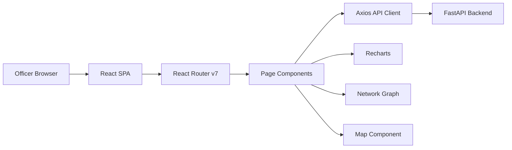

# Sentinel AI

## Frontend Module

> React 19 + TypeScript single-page application providing a modern, role-aware operational interface for the Sentinel AI crime intelligence operating system.

[](https://react.dev/)
[](https://www.typescriptlang.org/)
[](https://vite.dev/)
[](https://tailwindcss.com/)
[](https://reactrouter.com/)

Sentinel AI is an AI-powered crime intelligence operating system. This branch contains the frontend application that provides officers with a secure, role-scoped interface for case management, analytics, AI assistance, geographic intelligence, and criminal network visualisation.

This README documents the Frontend branch only. It intentionally excludes backend API implementation and data pipeline details.

---

## Project Objectives

The frontend is designed to:

- Provide a secure, role-scoped login and session management experience for law enforcement officers.
- Display a real-time dashboard of KPIs, recent cases, and alerts scoped to the officer's jurisdiction.
- Offer a searchable FIR and crime database with detailed case views.
- Provide an AI assistant interface for natural-language case queries.
- Render a geographic crime map and criminal network graph.
- Display analytics charts, crime trends, and district-level statistics.
- Enable document OCR submission and review, and AI-generated investigative report access.

## Problem Statement

Law enforcement officers need an interface that surfaces relevant case information without exposing records outside their geographic jurisdiction. Without a purpose-built UI, investigators must navigate between disparate systems, losing context and wasting time on manual data assembly.

The Frontend module solves this by presenting jurisdiction-scoped case data through a unified operational interface with integrated AI assistance and visual analytics.

## Why This Module Exists

The frontend provides:

- A single operational cockpit replacing multiple disconnected tools.
- Real-time KPI tiles and trend charts surfaced from the analytics API.
- An embedded AI chat and report interface reducing manual report-writing effort.
- A visual criminal network graph for relationship intelligence.
- A GIS crime map for geographic pattern analysis.

---

## 1. Architecture Overview



### Component hierarchy

| Layer | Responsibility |
|---|---|
| Pages | Route-level views consuming API data |
| Components | Shared layout, UI primitives, and feature widgets |
| API client | Axios functions wrapping every backend endpoint |
| Routes | React Router configuration and protected route guards |
| Utils | Shared formatting, date, and helper functions |

---

## 2. Repository Structure

```text
src/
├── App.tsx                      # Application root and router provider
├── main.tsx                     # Application entry point and React root mount
├── index.css                    # Global CSS reset and base styles
├── pages/
│   ├── Login/                   # Officer login page
│   ├── Dashboard/               # KPI summary, recent cases, alert feed
│   ├── CrimeDatabase/           # FIR and crime registry with search
│   ├── CrimeDetails/            # Detailed case view with enriched fields
│   ├── Investigation/           # Active investigation workspace
│   ├── CriminalNetwork/         # Neo4j-powered network graph visualisation
│   ├── Analytics/               # Charts, trends, and district statistics
│   ├── GIS/                     # Geographic crime map
│   ├── AIAssistant/             # Gemini AI chat interface
│   ├── OCRReview/               # Document OCR extraction and review
│   ├── Reports/                 # AI-generated investigative reports
│   ├── Settings/                # User and system settings
│   └── Loading/                 # Loading state and splash screen
├── components/
│   ├── layout/                  # Sidebar, topbar, page shell, and navigation
│   ├── common/                  # Reusable cards, tables, badges, and modals
│   ├── ui/                      # Primitive inputs, buttons, dropdowns, and forms
│   └── animations/              # Lottie animation wrappers
├── api/                         # Axios API client functions by domain
├── routes/                      # React Router route definitions and guards
├── styles/                      # Shared CSS modules and design tokens
├── assets/                      # Static images, icons, and Lottie JSON files
└── utils/                       # Shared utilities, formatters, and helpers
```

### Root configuration files

```text
index.html                       # HTML shell with React mount point
vite.config.ts                   # Vite development server and build configuration
tsconfig.json                    # TypeScript root configuration
tsconfig.app.json                # TypeScript application configuration
tsconfig.node.json               # TypeScript node tool configuration
package.json                     # NPM dependencies and scripts
eslint.config.js                 # ESLint configuration
```

---

## 3. Page Modules

### Login

- Officer login form with username and password fields.
- Submits credentials to `POST /api/v1/auth/login`.
- Stores the JWT access token in session state.
- Redirects to the dashboard on successful authentication.

### Dashboard

- Displays KPI summary tiles: total FIRs, active cases, resolved cases, suspects, evidence, and officers.
- Shows a feed of recent case registrations.
- Surfaces critical alerts and severity-flagged cases.
- All data is scoped to the officer's role and jurisdiction.

### CrimeDatabase

- Searchable and filterable list of FIRs and crime records.
- Filters by status, severity, district, and date range.
- Each row links to the CrimeDetails page.

### CrimeDetails

- Detailed case view including FIR metadata, crime description, officer assignment, suspects, victims, and evidence items.
- Displays modus operandi and crime category.
- Entry point for AI report generation.

### Investigation

- Active investigation workspace with diary entry creation.
- Displays diary entries linked to a specific FIR.
- Supports narrative entry of investigation progress.

### CriminalNetwork

- Graph visualisation of the criminal relationship network.
- Powered by the Neo4j knowledge graph data.
- Nodes represent persons, cases, devices, and accounts.
- Edges represent communication, ownership, and case involvement relationships.

### Analytics

- Interactive charts for crime trend analysis over time.
- District-level crime breakdown and comparison.
- Crime category distribution charts.
- Powered by Recharts with data from the analytics API.

### GIS

- Geographic crime map visualising incident locations.
- District and police station markers.
- Crime hotspot clustering view.

### AIAssistant

- Chat interface for querying the Gemini AI case assistant.
- Sends natural-language questions to `POST /api/v1/ai/assistant`.
- Displays formatted AI responses within the case context.

### OCRReview

- Document image upload and OCR text extraction.
- Displays extracted text for review and copy.
- Falls back to Gemini multimodal OCR when Tesseract is unavailable.

### Reports

- Access and display of AI-generated investigative briefs.
- Selects a case and requests generation via `POST /api/v1/ai/report`.
- Renders the structured six-section report in a readable format.

### Settings

- Officer profile and system preference settings.

---

## 4. Component Library

### Layout components

| Component | Purpose |
|---|---|
| `Sidebar` | Navigation rail with route links and user info |
| `Topbar` | Page header with breadcrumbs and user session controls |
| `PageShell` | Wrapper providing consistent page padding and structure |

### Common components

| Component | Purpose |
|---|---|
| `KPICard` | Summary metric tile with icon and value |
| `CaseTable` | Sortable and filterable FIR list table |
| `EvidenceBadge` | Colour-coded evidence type indicator |
| `StatusBadge` | FIR status label with severity colour |
| `Modal` | Accessible modal overlay |
| `ConfirmDialog` | Confirmation prompt for destructive actions |

### UI primitives

| Component | Purpose |
|---|---|
| `Input` | Styled text input with validation state |
| `Button` | Variant-aware action button |
| `Dropdown` | Select input with accessible keyboard handling |
| `SearchBar` | Debounced search input |

---

## 5. API Client

The `src/api/` directory contains Axios functions for every backend domain, mapping to the FastAPI route contracts.

### Domain grouping

| File | Backend module | Endpoints covered |
|---|---|---|
| `auth.ts` | `/api/v1/auth` | Login and token management |
| `core.ts` | `/api/v1/core` | FIRs, crimes, evidence, officers, diary |
| `analytics.ts` | `/api/v1/analytics` | KPIs, trends, search, statistics |
| `ai.ts` | `/api/v1/ai` | OCR, assistant, reports, translation |

### Authentication header

After login, the JWT token is attached to every Axios request as:

```
Authorization: Bearer <access_token>
```

---

## 6. Routing

React Router v7 manages client-side routing. Protected routes redirect to `/login` if no valid session token is present.

### Route map

| Path | Component | Access |
|---|---|---|
| `/login` | `Login` | Public |
| `/` | Redirect to `/dashboard` | Protected |
| `/dashboard` | `Dashboard` | Protected |
| `/crimes` | `CrimeDatabase` | Protected |
| `/crimes/:id` | `CrimeDetails` | Protected |
| `/investigation` | `Investigation` | Protected |
| `/network` | `CriminalNetwork` | Protected |
| `/analytics` | `Analytics` | Protected |
| `/gis` | `GIS` | Protected |
| `/ai` | `AIAssistant` | Protected |
| `/ocr` | `OCRReview` | Protected |
| `/reports` | `Reports` | Protected |
| `/settings` | `Settings` | Protected |

---

## 7. Execution Guide

### Requirements

- Node.js 18 or newer.
- The Sentinel AI backend running at `http://localhost:8000`.

### Install dependencies

```bash
npm install
```

### Run the development server

```bash
npm run dev
```

The frontend will be available at `http://localhost:5173`.

### Build for production

```bash
npm run build
```

The production bundle will be output to `dist/`.

### Preview the production build

```bash
npm run preview
```

### Lint the codebase

```bash
npm run lint
```

---

## 8. Environment Variables

The frontend reads the backend API base URL from the environment. Create a `.env.local` file in the project root.

```env
VITE_API_BASE_URL=http://localhost:8000/api/v1
```

| Variable | Purpose |
|---|---|
| `VITE_API_BASE_URL` | Base URL for all Axios API requests |

Never commit the `.env.local` file to version control.

---

## 9. Frontend Dependencies

### Production dependencies

| Package | Version | Purpose |
|---|---|---|
| `react` | 19 | UI component framework |
| `react-dom` | 19 | React DOM renderer |
| `react-router-dom` | v7 | Client-side routing |
| `axios` | 1.18+ | HTTP client for backend API calls |
| `recharts` | 3.9+ | Dashboard charts and data visualisations |
| `lucide-react` | 1.24+ | Icon library |
| `lottie-react` | 2.4+ | Lottie animation playback |
| `tailwindcss` | v4 | Utility-first CSS framework |

### Development dependencies

| Package | Version | Purpose |
|---|---|---|
| `typescript` | 6.0 | Static type checking |
| `vite` | 8 | Development server and bundler |
| `@vitejs/plugin-react` | 6.0 | React support for Vite |
| `eslint` | 10 | Code quality and linting |
| `typescript-eslint` | 8 | TypeScript-aware ESLint rules |

---

## 10. Generated Output

Running the frontend in development produces:

- A hot-reloading development server at `http://localhost:5173`.
- Fully typed React components consuming the FastAPI backend.
- Interactive dashboard, case management, and AI assistance interfaces.
- Production bundle in `dist/` when built with `npm run build`.

---

## 11. Achievements

- Built a 13-page React 19 + TypeScript SPA with React Router v7 routing.
- Implemented JWT-based session management with protected route guards.
- Built a real-time dashboard with KPI tiles and case feeds from the backend API.
- Integrated Recharts for crime trend and district analytics visualisations.
- Implemented an AI assistant chat interface backed by the Gemini API.
- Built a document OCR review workflow with Tesseract and Gemini fallback.
- Implemented a structured investigative report display backed by AI generation.
- Designed a component library with layout, common, and UI primitive layers.

---

## 12. Future Improvements

- Add real-time case update notifications using WebSocket subscriptions.
- Implement a full criminal network graph with interactive zoom and filtering.
- Add map-based crime hotspot clustering in the GIS module.
- Implement pagination and infinite scroll for large FIR lists.
- Add dark mode and accessibility compliance.
- Add unit and integration tests using Vitest and React Testing Library.
- Add role-based UI element visibility in addition to route protection.
- Implement local state management using Zustand or React Context.
- Add offline capability and service worker caching for field use.

---

## 13. Technology Stack

| Technology | Use |
|---|---|
| React 19 | UI component framework |
| TypeScript 6 | Static typing |
| Vite 8 | Development server and production bundler |
| React Router v7 | Client-side routing and navigation |
| Tailwind CSS v4 | Utility-first styling |
| Axios | HTTP client for backend API integration |
| Recharts | Interactive charts and data visualisations |
| Lucide React | Icon library |
| Lottie React | Animation playback |
| ESLint | Code quality and consistency |

---

## 14. Contributors

| Role | Contributor |
|---|---|
| Frontend Architecture | `<name>` |
| UI Component Design | `<name>` |
| API Integration | `<name>` |
| Routing and State | `<name>` |
| QA and Testing | `<name>` |
| Technical Documentation | `<name>` |

---

## License and Data Safety

This frontend consumes jurisdiction-scoped case data from the backend. Never expose real officer credentials, case identifiers, or personal data in frontend source code, environment files, or commits.

---

## Status

```text
Development server      : npm run dev — http://localhost:5173
Backend dependency      : http://localhost:8000 must be running
Pages operational       : 13
Component layers        : layout, common, ui, animations
Build tool              : Vite 8
TypeScript              : Strict mode
```
