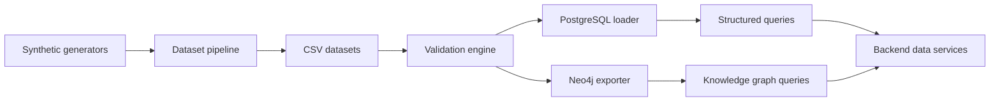
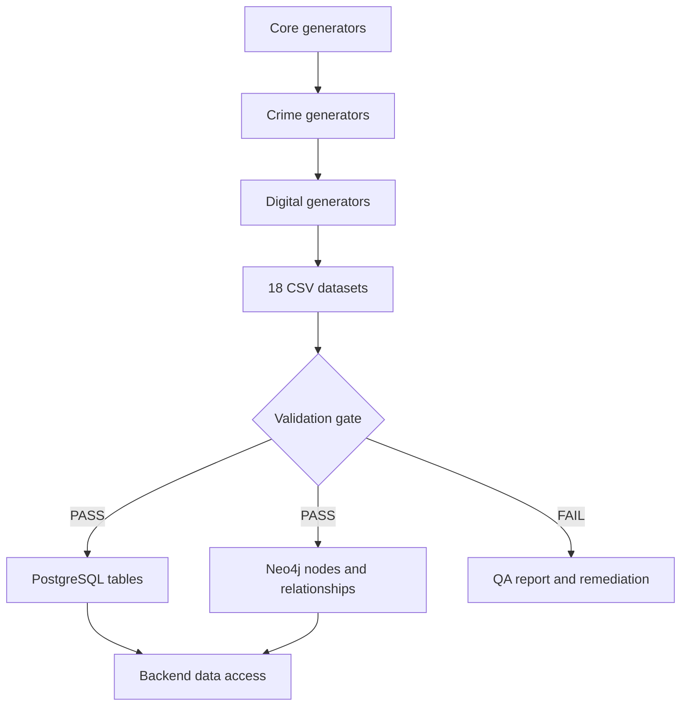

# Sentinel AI

## Data Engineering Module

> Synthetic crime intelligence data generation, quality validation, relational loading, and knowledge-graph export.

[](https://www.python.org/)
[](https://www.postgresql.org/)
[](https://neo4j.com/cloud/aura/)
[](#validation-engine)

Sentinel AI is an AI-powered crime intelligence operating system. This branch contains the data engineering module that creates a consistent synthetic crime-data ecosystem and makes it available to relational and graph data stores.

This README documents the Data Engineering branch only. It intentionally excludes frontend behavior and AI model implementation details.

---

## Project Objectives

The module is designed to:

- Generate a reproducible synthetic crime intelligence dataset.
- Preserve referential integrity across people, cases, evidence, legal records, and communications.
- Validate identifiers, relationships, values, and event chronology before loading.
- Load tabular datasets into PostgreSQL for structured querying.
- Export connected entities and events into Neo4j for graph analysis.
- Provide a repeatable local execution path for development and QA.

## Problem Statement

Crime investigations combine records from many operational sources: people, phone numbers, vehicles, bank accounts, cases, FIRs, evidence, arrests, court activity, and digital communications. Without a shared data contract, these records are difficult to validate, query, and connect.

The Data Engineering module provides that contract through deterministic identifiers, explicit foreign-key relationships, timeline checks, CSV interchange files, PostgreSQL tables, and Neo4j relationships.

## Why This Module Exists

The module creates a safe, repeatable foundation for:

- ETL and data-quality testing without exposing operational records.
- Backend API development against predictable schemas.
- Relational reporting and aggregation.
- Network, communication, and financial relationship analysis.
- Demonstrations and automated QA using known record counts.

---

## 1. Architecture Overview

The pipeline follows a staged data contract:



### Processing stages

| Stage | Component | Responsibility | Output |
|---|---|---|---|
| Generate | `dataset_pipeline.py` | Create all synthetic records in dependency order | 18 CSV files |
| Validate | `final_validation_engine.py` | Check keys, relationships, and timelines | PASS/FAIL report |
| Load | `postgresql_loader.py` | Load CSVs into PostgreSQL and verify counts | Relational tables |
| Export | `neo4j_exporter.py` | Create graph nodes and relationships | Neo4j graph |
| Serve | Backend data services | Consume structured and graph data | Query-ready data |

---

## 2. Repository Structure

```text
backend/
├── config/
│   ├── lookup/                  # Domain lookup values
│   └── system.py                # Backend configuration
├── data/
│   └── generated/               # Generated CSV datasets
├── scripts/
│   ├── generators/              # Domain-specific record generators
│   │   ├── core/
│   │   ├── crime/
│   │   ├── digital/
│   │   ├── intelligence/
│   │   └── relationships/
│   ├── pipeline/
│   │   └── dataset_pipeline.py  # End-to-end CSV generation
│   ├── validation/
│   │   └── final_validation_engine.py
│   └── database/
│       ├── postgresql_loader.py
│       └── neo4j_exporter.py
├── logs/                        # Runtime logs when enabled
└── exports/                     # Optional database exports
config/                          # Project-level configuration
database/                        # Application database services
etl/                             # General ETL utilities
neo4j/                           # Existing graph service utilities
requirements.txt                 # Python dependencies
README.md                        # This document
```

### Folder responsibilities

- `backend/data/generated/` is the canonical output location for this module.
- `backend/scripts/generators/` contains the domain generator implementations.
- `backend/scripts/pipeline/` controls execution order and output management.
- `backend/scripts/validation/` checks the generated data before database loading.
- `backend/scripts/database/` contains PostgreSQL and Neo4j integration entry points.
- `backend/config/` contains lookup data and backend configuration values.

---

## 3. Synthetic Dataset Generation

The pipeline currently produces 18 CSV files and 1,460 synthetic records. Each dataset has a stable primary identifier and explicit links to related datasets.

| Dataset | Purpose | Primary key | Important relationships |
|---|---|---|---|
| `persons.csv` | People participating in investigations | `person_id` | Parent entity for phones, vehicles, accounts, devices, and cases |
| `phones.csv` | Subscriber and device identifiers | `phone_id` | `person_id` → persons |
| `vehicles.csv` | Registered vehicles | `vehicle_id` | `person_id` → persons |
| `bank_accounts.csv` | Financial accounts | `account_id` | `person_id` → persons |
| `transactions.csv` | Account activity | `transaction_id` | `account_id` → bank accounts |
| `cases.csv` | Investigation cases and incident dates | `case_id` | Parent for legal and investigative records |
| `case_person_relationships.csv` | People assigned to cases and roles | `relationship_id` | `case_id`, `person_id` |
| `fir.csv` | First Information Reports | `fir_id` | `case_id`, `complainant_id` |
| `evidence.csv` | Evidence collected for an FIR | `evidence_id` | `fir_id`, `case_id` |
| `arrests.csv` | Arrest events | `arrest_id` | `fir_id`, `case_id`, `suspect_id` |
| `chargesheets.csv` | Filed chargesheets | `chargesheet_id` | `fir_id`, `case_id`, `suspect_id` |
| `court_cases.csv` | Court hearings | `court_case_id` | `chargesheet_id`, `case_id` |
| `investigation_diary.csv` | Investigation activity entries | `diary_id` | `case_id` |
| `devices.csv` | Digital devices associated with people | `device_id` | `person_id` |
| `cdr.csv` | Call-detail records | `cdr_id` | Sender, receiver, and case links |
| `sms_records.csv` | SMS messages | `sms_id` | Sender, receiver, and case links |
| `whatsapp_messages.csv` | WhatsApp messages | `message_id` | Sender, receiver, and case links |
| `emails.csv` | Email communication records | `email_id` | Sender, receiver, and case links |

### Generated field groups

The CSV schemas contain the following field groups:

- Identity: names, gender, date of birth, age, and government-style identifiers.
- Contact: phone number, provider, SIM details, IMEI, and IMSI.
- Ownership: vehicle registration, account ownership, and device association.
- Legal: case numbers, FIR numbers, chargesheets, arrests, hearings, and diary entries.
- Evidence: evidence type, FIR link, case link, and collection timestamp.
- Communication: sender, receiver, case link, timestamps, and channel-specific metadata.
- Finance: account references, transaction timestamps, amounts, and transaction types.

### Data contract

- Primary identifiers are non-null and unique within each dataset.
- Foreign identifiers point to existing parent records.
- Case events follow a valid chronology.
- Communication timestamps are valid and bounded by the generated execution context.
- Generated files are written with UTF-8 encoding and header rows.

### Historical coverage

The synthetic records are distributed across multiple years rather than being limited to the current calendar year:

| Dataset group | Coverage in the current baseline |
|---|---|
| Cases | Approximately 2016–2025 |
| Case-person assignments | Incident-relative historical dates |
| Arrests | Dates derived from each FIR and case timeline |
| Chargesheets | Dates derived from each arrest and FIR timeline |
| CDR records | Approximately 2016–2026 |
| WhatsApp messages | Approximately 2016–2026 |

All timestamps remain linked to their parent case and are generated without changing identifiers or relationships.

---

## 4. Synthetic Data Pipeline

`backend/scripts/pipeline/dataset_pipeline.py` is the main generation entry point.

### Responsibilities

1. Resolve the backend root and generated-data directory.
2. Create or clean the output directory.
3. Generate parent datasets before dependent datasets.
4. Write each dataset as a CSV file.
5. Print file and record totals.

### Generation order

```text
Persons
  ├── Phones
  ├── Vehicles
  ├── Bank Accounts
  │     └── Transactions
  └── Devices
Cases
  └── Case-person relationships
        ├── FIR
        │     ├── Evidence
        │     ├── Arrests
        │     │     └── Chargesheets
        │     │           └── Court cases
        │     └── Investigation diary
        └── Digital communications
```

### Output location

```text
backend/data/generated/
```

The pipeline does not require database connectivity to generate or validate CSVs.

---

## 5. Validation Engine

`backend/scripts/validation/final_validation_engine.py` validates the generated CSV bundle before database integration.

### Validation checks

| Check | Description |
|---|---|
| Primary keys | Confirms required identifier columns exist, are non-null, and are unique |
| Foreign keys | Confirms child references resolve to parent identifiers |
| Missing values | Detects missing identifiers and required relationship values |
| Duplicate IDs | Detects repeated identifiers within each dataset |
| Timeline validation | Confirms FIR, arrest, chargesheet, and court chronology |
| Relationship validation | Confirms case, person, FIR, evidence, and communication links |
| Data consistency | Confirms all expected CSV datasets can be loaded |

### Current validation result

```text
Datasets: 18
Records: 1460
Status: PASS
Errors: 0
Warnings: 0
```

Validation is a required gate before PostgreSQL or Neo4j loading.

---

## 6. PostgreSQL Integration

`backend/scripts/database/postgresql_loader.py` loads the generated CSVs into PostgreSQL.

### Loading strategy

- Reads connection settings from `.env` using `python-dotenv`.
- Loads tables in dependency order.
- Uses Pandas and SQLAlchemy for bulk table loading.
- Uses PostgreSQL SSL mode when configured.
- Creates unique indexes for dataset primary identifiers.
- Queries row counts after loading and compares them with CSV counts.
- Fails loudly when a required file is missing or counts differ.

### Logical table order

```text
persons → phones, vehicles, bank_accounts, devices
bank_accounts → transactions
cases → case_person_relationships, fir, evidence, arrests, chargesheets, court_cases, diary
persons + cases → cdr, sms_records, whatsapp_messages, emails
```

### Verification queries

```sql
SELECT COUNT(*) FROM persons;
SELECT COUNT(*) FROM cases;
SELECT COUNT(*) FROM fir;
SELECT COUNT(*) FROM transactions;
SELECT COUNT(*) FROM cdr;
```

The expected result for the generated bundle is the corresponding CSV row count.

---

## 7. Neo4j Knowledge Graph

`backend/scripts/database/neo4j_exporter.py` projects the relational CSV model into a connected Neo4j graph.

### Node labels

```text
Person
Phone
Vehicle
BankAccount
Transaction
Case
FIR
Evidence
Arrest
Chargesheet
CourtCase
Device
```

### Relationship types

| Relationship | Meaning |
|---|---|
| `OWNS` | Person owns a phone, vehicle, or bank account |
| `USES` | Person uses a device |
| `INVOLVED_IN` | Person has a role in a case |
| `HAS_FIR` | Case has an FIR |
| `HAS_EVIDENCE` | FIR has evidence |
| `RESULTED_IN` | FIR resulted in an arrest |
| `CHARGED_AS` | Arrest or legal record links to a chargesheet |
| `HEARD_IN` | Chargesheet is heard in court |
| `CALLED` | Person communicated with another person by phone |
| `SMS` | Person sent an SMS to another person |
| `WHATSAPP` | Person sent a WhatsApp message |
| `EMAILED` | Person emailed another person |
| `TRANSFERRED_TO` | Account-to-account financial movement |

### Example Cypher queries

```cypher
MATCH (p:Person) RETURN count(p) AS people;
MATCH (c:Case) RETURN count(c) AS cases;
MATCH (f:FIR) RETURN count(f) AS firs;
MATCH ()-[r]->() RETURN type(r), count(r) ORDER BY count(r) DESC;
```

```cypher
MATCH path = (a:Person {person_id: $start})-[*1..4]-(b:Person {person_id: $end})
RETURN path
LIMIT 1;
```

---

## 8. End-to-End Data Flow



---

## 9. Execution Guide

### Requirements

- Python 3.11 or newer.
- PostgreSQL 15 or a compatible managed PostgreSQL service.
- Neo4j 5.x or Neo4j AuraDB.
- Network access to managed database endpoints when loading remotely.

### Create a virtual environment

```bash
python -m venv .venv
source .venv/bin/activate
```

On Windows PowerShell:

```powershell
python -m venv .venv
.\.venv\Scripts\Activate.ps1
```

### Install dependencies

```bash
pip install -r requirements.txt
```

### Generate datasets

```bash
python backend/scripts/pipeline/dataset_pipeline.py
```

### Validate datasets

```bash
python backend/scripts/validation/final_validation_engine.py
```

### Load PostgreSQL

```bash
python backend/scripts/database/postgresql_loader.py
```

### Export Neo4j

```bash
python backend/scripts/database/neo4j_exporter.py
```

Run validation before database loading. Do not commit `.env` or database credentials.

---

## 10. Environment Variables

Create a local `.env` file from `.env.example`.

```env
POSTGRES_HOST=localhost
POSTGRES_PORT=5432
POSTGRES_DATABASE=sentinel_ai
POSTGRES_USER=sentinel_user
POSTGRES_PASSWORD=change_me
POSTGRES_SSLMODE=require

NEO4J_URI=neo4j+s://your-instance.databases.neo4j.io
NEO4J_USERNAME=neo4j
NEO4J_PASSWORD=change_me
```

| Variable | Purpose |
|---|---|
| `POSTGRES_HOST` | PostgreSQL hostname |
| `POSTGRES_PORT` | PostgreSQL port, normally `5432` |
| `POSTGRES_DATABASE` | Target database name |
| `POSTGRES_USER` | Database user |
| `POSTGRES_PASSWORD` | Database password |
| `POSTGRES_SSLMODE` | PostgreSQL transport mode |
| `NEO4J_URI` | Neo4j Bolt or secure Bolt URI |
| `NEO4J_USERNAME` | Neo4j username |
| `NEO4J_PASSWORD` | Neo4j password |

Credentials are loaded at runtime and must remain outside version control. The README contains placeholders only; never add real passwords, API keys, connection strings, tokens, or `.env` files to Git.

---

## 11. Generated Output

The data engineering execution produces:

- 18 generated CSV datasets.
- A validation summary containing dataset, record, error, and warning totals.
- PostgreSQL tables and verification counts when configured.
- Neo4j nodes and relationships when configured.
- Runtime logs when logging is enabled by the host environment.

The current synthetic baseline contains 1,460 records across the 18 CSV files, with historical variation across cases, legal events, case-person assignments, CDRs, and WhatsApp messages.

---

## 12. Achievements

- Designed a synthetic crime intelligence data model.
- Built a dependency-aware dataset generation pipeline.
- Generated 18 linked datasets.
- Generated 1,460 synthetic records.
- Added primary-key and foreign-key validation.
- Added timeline and relationship consistency checks.
- Implemented PostgreSQL loading and count verification.
- Implemented Neo4j graph export.
- Modeled ownership, case, legal, communication, and device relationships.
- Established a repeatable data foundation for downstream intelligence features.

---

## 13. Future Improvements

- Add configurable dataset sizes and generation profiles.
- Add larger-volume performance fixtures.
- Add incremental and idempotent database loading.
- Add streaming ingestion with Kafka.
- Add real-time ETL orchestration.
- Add formal PostgreSQL foreign-key constraints and migration versioning.
- Add Neo4j uniqueness constraints and schema migrations.
- Add automated graph analytics and repeat-offender analysis.
- Add CI checks for schema drift and row-count regressions.
- Add partitioning and retention policies for high-volume communications.

---

## 14. Technology Stack

| Technology | Use |
|---|---|
| Python | Generation, validation, orchestration, and database integration |
| Pandas | Tabular loading and data handling |
| NumPy | Numerical support for data workflows |
| PostgreSQL | Relational persistence and SQL verification |
| Neo4j AuraDB | Connected crime-intelligence graph |
| CSV | Portable generated-data interchange format |
| SQLAlchemy | PostgreSQL connection and loading abstraction |
| `psycopg2-binary` | PostgreSQL driver |
| `neo4j` Python driver | Neo4j connectivity and Cypher execution |
| `python-dotenv` | Runtime environment configuration |
| Faker and lookup data | Realistic synthetic values where configured |

---

## 15. Contributors

| Role | Contributor |
|---|---|
| Data Engineering | `<name>` |
| Backend Architecture | `<name>` |
| Database Engineering | `<name>` |
| QA and Validation | `<name>` |
| Technical Documentation | `<name>` |

---

## License and Data Safety

This branch contains synthetic data intended for development, testing, and demonstration. Never place operational personal data or production credentials in generated files, commits, issues, or documentation.

---

## Status

The synthetic data pipeline and validation baseline are operational locally:

```text
18 CSV files
1,460 records
Validation: PASS
Errors: 0
Warnings: 0
```
