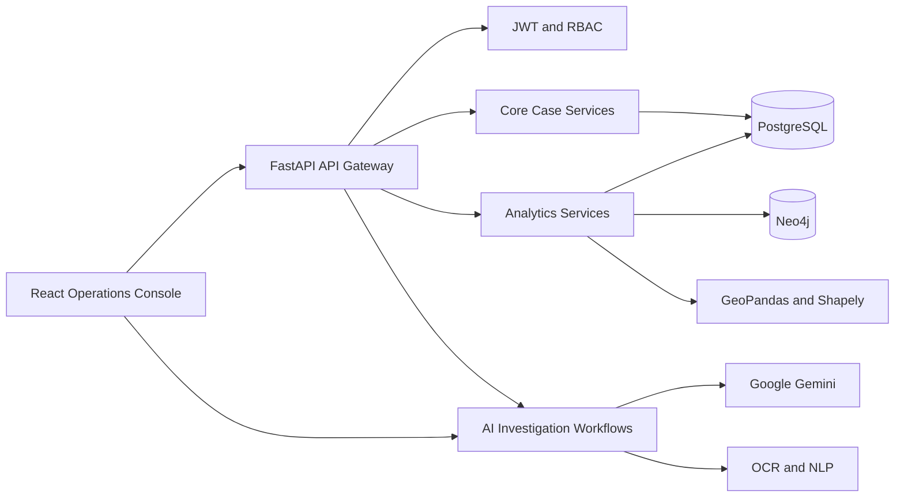
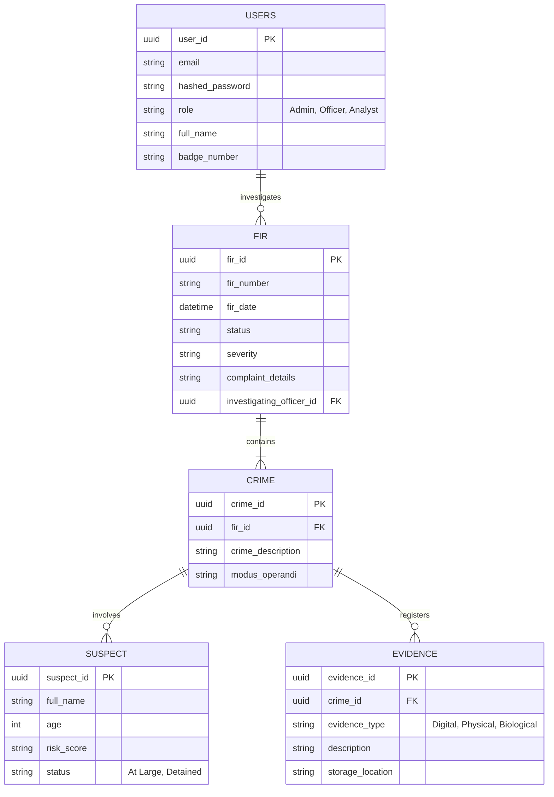

<div align="center">
  
  <h1>Sentinel AI</h1>
  <p><b>Next-Generation AI-Powered Crime Intelligence & Investigation Operating System</b></p>

  [](https://react.dev)
  [](https://fastapi.tiangolo.com)
  [](https://neon.tech)
  [](https://neo4j.com)
  [](https://deepmind.google/technologies/gemini/)
  [](https://tailwindcss.com)
</div>

<br />

<p align="center">
  <a href="#overview">Overview</a> ·
  <a href="#key-features">Key Features</a> ·
  <a href="#technology-stack">Tech Stack</a> ·
  <a href="#architecture">Architecture</a> ·
  <a href="#getting-started">Getting Started</a> ·
  <a href="DEMO.md">Live Demo</a>
</p>

**Sentinel AI** is an enterprise-grade, comprehensive Crime Intelligence platform designed for modern law enforcement and intelligence agencies. It seamlessly bridges raw operational data, geospatial analytics, graph-based criminal networks, and state-of-the-art Generative AI to accelerate case resolution and provide unprecedented tactical insights.

---
<a id="key-features"></a>

## ✨ Key Features

| Capability | What it enables |
| :--- | :--- |
| **AI-powered case intake** | Extracts text and investigative entities from uploaded FIRs and evidence documents, then presents the output for review. |
| **Multilingual intelligence** | Translates regional-language case material and structures key entities for easier investigation. |
| **Crime pattern matching** | Compares modus operandi, case details, and related signals to surface potentially linked cases. |
| **Criminal network analysis** | Explores relationships between people, cases, vehicles, devices, and other intelligence entities through an interactive graph. |
| **GIS and analytics** | Visualizes crime hotspots, geographic patterns, operational metrics, and trends for informed deployment. |
| **Investigation workspace** | Keeps case summaries, evidence, suspects, timelines, actions, and officer diary entries together in one workflow. |
| **AI investigation assistant** | Supports natural-language questions, summaries, recommendations, and voice-assisted investigation flows. |
| **Role-aware access** | Uses JWT authentication and role-based permissions for administrators, officers, and analysts. |

---
<a id="technology-stack"></a>

## 🧰 Technology Stack

| Layer | Technologies |
| :--- | :--- |
| **Frontend** | React 19, TypeScript, Vite, React Router, Tailwind CSS 4 |
| **User experience** | Recharts, Lucide React, Lottie, React Markdown, jsPDF + AutoTable |
| **Backend API** | Python, FastAPI, Uvicorn, Pydantic |
| **Data layer** | PostgreSQL, SQLAlchemy, Alembic, Neon-compatible PostgreSQL |
| **Graph intelligence** | Neo4j |
| **AI and language** | Google Gemini, spaCy, RapidFuzz, EasyOCR, Tesseract |
| **Geospatial and analytics** | GeoPandas, Shapely, Pandas, NumPy, Plotly |
| **Security** | JWT, Argon2 password hashing via `pwdlib`, role-based access control |

---


The project is heavily decentralized into four major operational domains to ensure scalability and maintainability. Each domain serves a critical function in the intelligence lifecycle.

<br>

## 🏗️ Architecture & Domain Deep-Dive

The project is heavily decentralized into four major operational domains to ensure scalability and maintainability. Each domain serves a critical function in the intelligence lifecycle.

<br>

### 🧠 1. Artificial Intelligence (AI) Domain
> *The AI domain acts as a digital force multiplier for investigating officers, automating thousands of hours of manual paperwork and data synthesis.*

| Feature | Technical Breakdown & Capability |
| :--- | :--- |
| 🌐 **Multilingual AI Translation** | **Breaks down regional language barriers.** <br/> Vernacular documents (FIRs in Kannada, Hindi, Marathi) are instantly translated into English using advanced LLMs. *Crucially*, the AI actively performs **Named Entity Recognition (NER)** to extract IPC/BNS Sections, Stolen Assets, and Suspect Names directly into structured PostgreSQL JSON fields. |
| 🔍 **Pattern Similarity (MO Matching)** | **Identifies serial offenders automatically.** <br/> Employs complex Natural Language Processing to scan the entire crime database. By mathematically matching *Modus Operandi (MO)* vectors and victimology profiles, it links seemingly isolated cases across different districts. |
| 🤖 **Interactive Case Assistant** | **Your personal AI co-investigator.** <br/> A securely sandboxed Generative AI instance loaded with your specific case files. Ask natural language queries like *"What is the timeline of events for FIR-123?"* or *"Cross-reference this suspect's aliases"* and get instant, cited answers. |
| 📄 **Automated PDF Dossiers** | **Instant Intelligence Briefs.** <br/> With a single click, the engine synthesizes raw database segments, timeline events, and AI insights into highly readable, official PDF intelligence briefs using `jsPDF`—ready for courtroom submission or senior officer review. |

<br>

### 🕸️ 2. Data Intelligence (Data & GIS) Domain
> *Standard relational tables struggle with complex criminal relationships. Our Data Intelligence layer maps the invisible connections between syndicates and geographies.*

| Feature | Technical Breakdown & Capability |
| :--- | :--- |
| 🔗 **Graph Network Analysis** | **Visualize the criminal underworld.** <br/> Powered by **Neo4j Graph Database**, the system maps out organized syndicates. It draws interactive, visual links between suspects, shared vehicles, burner phones, communication nodes, and multiple FIRs. |
| 🗺️ **Geospatial Intelligence (GIS)** | **Predictive policing through heatmaps.** <br/> Leveraging Python's **GeoPandas** and **Shapely**, the system renders high-performance interactive heatmaps and geographic clusters. This allows control rooms to deploy patrol units dynamically based on historical crime density and active threat alerts. |
| 🔬 **Digital Forensics** | **Uncover hidden digital trails.** <br/> Automatically parses raw CDRs (Call Detail Records) and IP activity logs. The system flags anomalous behavior, geo-fencing breaches, and cross-references active IPs against known cyber-threat blacklists. |

<br>

### 🖥️ 3. Frontend Operations Domain
> *Engineered specifically for high-pressure, 24/7 control room environments where readability and speed are paramount.*

| Feature | Technical Breakdown & Capability |
| :--- | :--- |
| 🌘 **Immersive Dark-Mode UI** | **Built for low-light operator environments.** <br/> Engineered with **React 19** and **TailwindCSS v4**, the interface prioritizes extreme readability. Smooth micro-animations, glassmorphism, and targeted color palettes reduce eye strain during prolonged monitoring sessions. |
| 📂 **Investigation Workspace** | **The central hub of truth.** <br/> A highly interactive, tabbed hub featuring comprehensive Evidence Boards, Suspect Grids, Timeline tracking, and integrated Toast notifications. Everything an officer needs is accessible within a maximum of two clicks. |
| 📓 **Officer Investigation Diary** | **Audited and secure.** <br/> A tamper-evident digital ledger where officers log daily updates, attach encrypted checksums to evidence, and dispatch compiled electronic dockets directly to their Superintendent of Police. |

<br>

### ⚙️ 4. Backend Architecture Domain
> *The robust, high-performance foundation providing iron-clad security and sub-second response times.*

| Feature | Technical Breakdown & Capability |
| :--- | :--- |
| ⚡ **Asynchronous Processing** | **Non-blocking high performance.** <br/> Built natively on **FastAPI** and **Uvicorn**, ensuring that heavy I/O tasks (like waiting for LLM generation, processing image OCR, or querying Neo4j) never block routine database queries from other users on the network. |
| 🗄️ **Database & ORM** | **Strict data integrity.** <br/> Powered by **SQLAlchemy** connected to a serverless **PostgreSQL (Neon)** cluster. Every API payload and database model is strictly validated and serialized via **Pydantic**, ensuring malformed data never enters the system. |
| 🔐 **Enterprise Security** | **Defense in depth.** <br/> Implements JWT-based Stateless Authentication, Argon2 military-grade password hashing (`pwdlib`), and strict Role-Based Access Control (RBAC). API routes are completely isolated to prevent cross-tenant data leaks. |

---

## 🗄️ Database Architecture (Entity Relationship)

Below is a high-level representation of the core PostgreSQL relational schema powering Sentinel AI.



---

## 🌟 What Makes Sentinel AI Different?

- **One connected intelligence workflow:** It brings document intake, case management, pattern analysis, graph intelligence, GIS, and reporting into the same investigative environment.
- **Built for local investigative context:** Multilingual processing and structured legal-entity extraction help officers work with regional-language FIRs and case records.
- **Relationships, not just records:** PostgreSQL preserves structured operational data while Neo4j exposes cross-case networks that relational views can hide.
- **Human-in-the-loop AI:** OCR and AI-derived intelligence are designed to be reviewed in the investigation workspace rather than treated as unquestioned automation.
- **Operationally focused interface:** The React console combines maps, dashboards, evidence, timelines, diaries, and assistant tools for high-pressure investigative work.

---
<a id="getting-started"></a>

## 🚀 Getting Started

### Prerequisites
- Node.js (v18 or higher)
- Python (3.12 or higher)
- `uv` (Fast Python package manager)
- Access to a PostgreSQL Database (e.g., Neon.tech)

### 1. Repository & Environment Setup
Clone the repository and prepare your environment variables.
```bash
git clone https://github.com/your-org/sentinel-ai.git
cd sentinel-ai

# Copy the template environment file
cp .env.example .env
```
Open the `.env` file and populate it with your specific credentials:
- `POSTGRES_HOST`, `POSTGRES_USER`, `POSTGRES_PASSWORD`
- `GEMINI_API_KEY` (Required for all AI functionalities)

### 2. Backend Initialization (FastAPI)
Open a terminal and start the backend service. We use `uv` for lightning-fast dependency management.
```bash
# Sync and install all Python dependencies
uv sync

# Boot the Uvicorn ASGI server with hot-reloading enabled
uv run uvicorn backend.main:app --port 8000 --reload
```
*The backend API documentation will be available at `http://localhost:8000/docs`.*

### 3. Frontend Initialization (React / Vite)
Open a **second terminal** and launch the frontend client.
```bash
# Install Node dependencies
npm install

# Start the Vite development server
npm run dev
```
*The web client will be accessible at `http://localhost:5173`.*

---

## 📖 How to Use (Quick Workflow)

1. **Dashboard Overview:** Upon login, view the high-level crime statistics and GIS heatmaps on the main dashboard.
2. **Ingest a Case:** Navigate to **FIR Upload**. Upload a physical document; the system will automatically run OCR to digitize it.
3. **Multilingual Processing:** If the FIR is in a regional language, navigate to **Multilingual AI** to instantly translate it and extract key legal entities into the database.
4. **Investigate:** Open the **Crime Database** and select a case to enter the **Investigation Workspace**. Here, you can review evidence, track suspects, and click **Generate Insight** to have the AI compile a comprehensive strategy.
5. **Analyze Networks:** Jump into the **Criminal Network** tab to view the Neo4j graph, visually identifying links between suspects across multiple cases.

 ```mermaid
flowchart TD
    A[Login to SENTINEL AI] --> B[Dashboard Overview]
    B --> B1[Review crime statistics]
    B --> B2[Review GIS heatmaps]

    B --> C[FIR Upload]
    C --> C1[Upload physical FIR document]
    C1 --> C2[OCR digitizes document text]

    C2 --> D{Regional language FIR?}
    D -- Yes --> E[Multilingual AI]
    E --> E1[Translate FIR]
    E1 --> E2[Extract legal entities]
    E2 --> F[Store case data]
    D -- No --> F

    F --> G[Crime Database]
    G --> H[Open Investigation Workspace]
    H --> H1[Review evidence]
    H --> H2[Track suspects]
    H --> H3[Generate AI insight and strategy]

    H --> I[Criminal Network]
    I --> I1[View Neo4j relationship graph]
    I1 --> I2[Identify cross-case suspect links]
```
---

## 🔑 Testing & Mock Credentials

For development and demonstration purposes, the system is seeded with mock data. You can log in using the following test credentials:

| Role | Email / Username | Password |
| :--- | :--- | :--- |
| **System Administrator** | `admin@sentinel.gov` | `admin123` |
| **Investigating Officer** | `officer@sentinel.gov` | `securepass` |
| **Intelligence Analyst** | `analyst@sentinel.gov` | `intel2026` |

*(Note: Ensure your backend migrations and seed scripts have been run if you are setting up a fresh database instance).*

---

## 🛡️ Security & Compliance
- **Data Privacy**: All AI processing limits PII exposure. Features are strictly scoped to authenticated user jurisdictions via RBAC (Role-Based Access Control).
- **Secret Management**: API keys and database credentials are strictly isolated in `.env` files (ignored via Git) to prevent accidental exposure.

<br/>
<div align="center">
  <sub>Built with precision for law enforcement and intelligence professionals.</sub>
</div>
