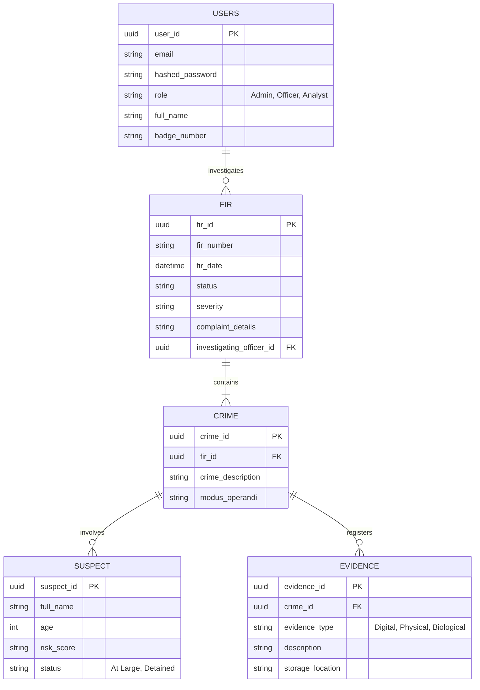

<div align="center">
  
  <h1>Sentinel AI</h1>
  <p><b>Next-Generation AI-Powered Crime Intelligence & Investigation Operating System</b></p>

  [](https://react.dev)
  [](https://fastapi.tiangolo.com)
  [](https://neon.tech)
  [](https://neo4j.com)
  [](https://deepmind.google/technologies/gemini/)
  [](https://tailwindcss.com)
</div>

<br />

**Sentinel AI** is an enterprise-grade, comprehensive Crime Intelligence platform designed for modern law enforcement and intelligence agencies. It seamlessly bridges raw operational data, geospatial analytics, graph-based criminal networks, and state-of-the-art Generative AI to accelerate case resolution and provide unprecedented tactical insights.

---

## 🏗️ Architecture & Domain Explanations

The project is heavily decentralized into four major operational domains to ensure scalability and maintainability.

### 🧠 1. Artificial Intelligence (AI) Domain
The AI domain is the core differentiator of Sentinel, acting as a force multiplier for investigating officers.
*   **Multilingual AI Translation Engine:** Translates vernacular documents (e.g., FIRs in Kannada, Hindi, Marathi) into English instantly. Crucially, it doesn't just translate text; it actively extracts legal parameters like **IPC/BNS Sections**, **Stolen Assets**, and **Suspect Names** into structured JSON for the database.
*   **Pattern Similarity & Modus Operandi Matching:** Employs advanced Natural Language Processing to scan the entire crime database and identify serial offenses. By matching Modus Operandi (MO) and victimology, it links seemingly isolated cases.
*   **Interactive Case Assistant:** A sandboxed LLM instance (powered by Gemini) that acts as a co-investigator. It reads case files and answers natural language queries (e.g., *"What is the timeline of events for FIR-123?"*).
*   **Automated PDF Dossiers:** Synthesizes raw database segments into highly readable, official PDF intelligence briefs using `jsPDF`.

### 🕸️ 2. Data Intelligence (Data & GIS) Domain
The Data layer handles complex relationships and geospatial intelligence that standard relational tables struggle with.
*   **Graph Network Analysis:** Utilizing **Neo4j**, the system maps out syndicates. It visualizes links between suspects, shared vehicles, communication nodes (IPs/Phone numbers), and multiple FIRs.
*   **Geospatial Intelligence (GIS):** Leveraging **GeoPandas** and **Shapely**, the system renders interactive heatmaps and geographic clusters. It helps control rooms deploy patrol units based on historical crime density.
*   **Digital Forensics:** Automatically parses CDRs (Call Detail Records) and IP logs for anomalous behavior and cross-references them against known blacklists.

### 🖥️ 3. Frontend Operations Domain
Built for high-pressure control room environments.
*   **Immersive Dark-Mode UI:** Engineered with **React 19** and **TailwindCSS v4**, the interface prioritizes readability in low-light environments (reducing eye strain for 24/7 operators).
*   **Investigation Workspace:** A highly interactive hub featuring Tabbed navigation, Evidence Boards, Suspect Grids, and integrated Toast notifications.
*   **Officer Investigation Diary:** A secure ledger where officers can digitally log updates, attach encrypted checksums, and dispatch reports directly to their superiors.

### ⚙️ 4. Backend Architecture Domain
The robust foundation providing security and speed.
*   **Asynchronous Processing:** Built on **FastAPI** and **Uvicorn**, ensuring that heavy tasks (like OCR or LLM generation) do not block routine database queries.
*   **Database & ORM:** Powered by **SQLAlchemy** connected to a serverless **PostgreSQL (Neon)** cluster, with strict schema enforcement via **Pydantic**.
*   **Enterprise Security:** Implements JWT-based Stateless Authentication, Argon2 password hashing, and Role-Based Access Control (RBAC).

---

## 🗄️ Database Architecture (Entity Relationship)

Below is a high-level representation of the core PostgreSQL relational schema powering Sentinel AI.



---

## 🚀 Installation & Setup Guide

### Prerequisites
- Node.js (v18 or higher)
- Python (3.12 or higher)
- `uv` (Fast Python package manager)
- Access to a PostgreSQL Database (e.g., Neon.tech)

### 1. Repository & Environment Setup
Clone the repository and prepare your environment variables.
```bash
git clone https://github.com/your-org/sentinel-ai.git
cd sentinel-ai

# Copy the template environment file
cp .env.example .env
```
Open the `.env` file and populate it with your specific credentials:
- `POSTGRES_HOST`, `POSTGRES_USER`, `POSTGRES_PASSWORD`
- `GEMINI_API_KEY` (Required for all AI functionalities)

### 2. Backend Initialization (FastAPI)
Open a terminal and start the backend service. We use `uv` for lightning-fast dependency management.
```bash
# Sync and install all Python dependencies
uv sync

# Boot the Uvicorn ASGI server with hot-reloading enabled
uv run uvicorn backend.main:app --port 8000 --reload
```
*The backend API documentation will be available at `http://localhost:8000/docs`.*

### 3. Frontend Initialization (React / Vite)
Open a **second terminal** and launch the frontend client.
```bash
# Install Node dependencies
npm install

# Start the Vite development server
npm run dev
```
*The web client will be accessible at `http://localhost:5173`.*

---

## 📖 How to Use (Quick Workflow)

1. **Dashboard Overview:** Upon login, view the high-level crime statistics and GIS heatmaps on the main dashboard.
2. **Ingest a Case:** Navigate to **FIR Upload**. Upload a physical document; the system will automatically run OCR to digitize it.
3. **Multilingual Processing:** If the FIR is in a regional language, navigate to **Multilingual AI** to instantly translate it and extract key legal entities into the database.
4. **Investigate:** Open the **Crime Database** and select a case to enter the **Investigation Workspace**. Here, you can review evidence, track suspects, and click **Generate Insight** to have the AI compile a comprehensive strategy.
5. **Analyze Networks:** Jump into the **Criminal Network** tab to view the Neo4j graph, visually identifying links between suspects across multiple cases.

---

## 🔑 Testing & Mock Credentials

For development and demonstration purposes, the system is seeded with mock data. You can log in using the following test credentials:

| Role | Email / Username | Password |
| :--- | :--- | :--- |
| **System Administrator** | `admin@sentinel.gov` | `admin123` |
| **Investigating Officer** | `officer@sentinel.gov` | `securepass` |
| **Intelligence Analyst** | `analyst@sentinel.gov` | `intel2026` |

*(Note: Ensure your backend migrations and seed scripts have been run if you are setting up a fresh database instance).*

---

## 🛡️ Security & Compliance
- **Data Privacy**: All AI processing limits PII exposure. Features are strictly scoped to authenticated user jurisdictions via RBAC (Role-Based Access Control).
- **Secret Management**: API keys and database credentials are strictly isolated in `.env` files (ignored via Git) to prevent accidental exposure.

<br/>
<div align="center">
  <sub>Built with precision for law enforcement and intelligence professionals.</sub>
</div>
