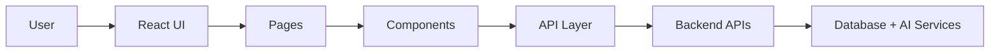
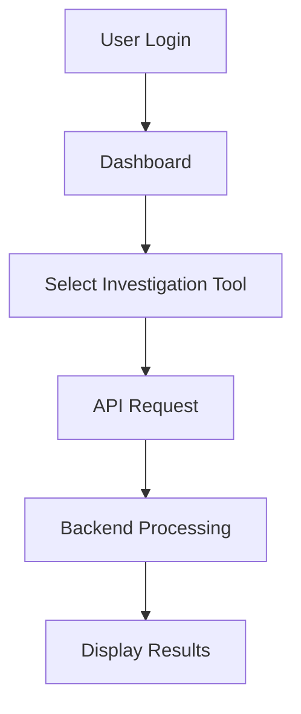

# Sentinel AI

## Frontend Module

> AI-powered crime intelligence interface built with React, TypeScript, and Vite.

[](https://react.dev/)
[](https://www.typescriptlang.org/)
[](https://vitejs.dev/)
[](https://tailwindcss.com/)
[](#features)

Sentinel AI is an AI-powered crime intelligence operating system. This branch contains the complete frontend interface that enables investigators to access AI-assisted tools, criminal intelligence, analytics, GIS visualization, multilingual processing, and investigation management through a modern responsive web application.

This README documents the Frontend module only. Backend implementation, AI pipelines, and database architecture are documented separately.

---

# Project Objectives

The frontend is designed to:

- Provide an intuitive interface for investigators.
- Visualize crime analytics through interactive dashboards.
- Enable AI-assisted investigations.
- Support multilingual intelligence processing.
- Display criminal relationship networks.
- Integrate GIS-based crime visualization.
- Provide investigation diary and report management.
- Communicate with backend APIs through a centralized API layer.

---

# Features

The frontend currently includes the following investigation modules:

- Dashboard
- Authentication
- AI Assistant
- Criminal Network Analysis
- Crime Database
- Crime Details
- Investigation Workspace
- Investigation Diary
- Digital Intelligence Hub
- GIS Crime Mapping
- OCR Review
- Reports
- Multilingual AI
- Loading & Animation System

---

# Architecture Overview



---

# Frontend Structure

```text
src/
│
├── api/
│   ├── core.api.ts
│   ├── analytics.api.ts
│   ├── dashboard.api.ts
│   └── ai.api.ts
│
├── assets/
│   ├── animations/
│   ├── audio/
│   └── images/
│
├── components/
│   ├── animations/
│   ├── common/
│   ├── layout/
│   └── ui/
│
├── pages/
│   ├── Dashboard/
│   ├── AIAssistant/
│   ├── CriminalNetwork/
│   ├── CrimeDatabase/
│   ├── CrimeDetails/
│   ├── DigitalIntelligenceHub/
│   ├── GIS/
│   ├── Investigation/
│   ├── InvestigationDiary/
│   ├── OCRReview/
│   ├── Reports/
│   ├── Login/
│   ├── Loading/
│   └── MultilingualAI/
│
├── routes/
├── utils/
└── main.tsx
```

---

# Technology Stack

| Technology | Purpose |
|------------|---------|
| React 19 | UI Framework |
| TypeScript | Type Safety |
| Vite | Build Tool |
| Tailwind CSS | Styling |
| Axios | API Communication |
| Framer Motion | Animations |
| React Router | Routing |
| Lottie | JSON Animations |

---

# API Integration

The frontend communicates with backend services using a centralized API layer.

Current API modules include:

- Dashboard API
- Analytics API
- AI API
- Core API

These modules abstract backend endpoints and make future API updates easier.

---

# Major Pages

| Module | Purpose |
|---------|---------|
| Dashboard | Investigation overview and quick access |
| AI Assistant | AI-powered investigation support |
| Criminal Network | Relationship visualization |
| Crime Database | Browse crime records |
| Crime Details | Detailed FIR and case information |
| Investigation Workspace | Active investigation management |
| Investigation Diary | Officer diary management |
| GIS | Crime location visualization |
| OCR Review | OCR verification |
| Reports | Report generation |
| Multilingual AI | Language translation and transcription |

---

# UI Features

- Responsive layout
- Dark investigation theme
- Animated loading screens
- Interactive cards
- Dynamic charts
- Floating Quick Action Menu
- Modular reusable components
- API-driven content
- Consistent typography
- Smooth transitions

---

# Frontend Workflow



---

# Installation

Clone the repository

```bash
git clone https://github.com/<repository>.git
```

Install dependencies

```bash
npm install
```

Run development server

```bash
npm run dev
```

Build production

```bash
npm run build
```

Preview production build

```bash
npm run preview
```

---

# Environment Variables

Create a `.env` file.

Example:

```env
VITE_API_BASE_URL=http://localhost:8000
```

---

# Current Achievements

- Complete responsive UI
- Backend API integration layer
- Dashboard analytics
- Criminal network visualization
- GIS interface
- AI investigation assistant
- OCR review workflow
- Digital Intelligence Hub
- Investigation diary
- Reports module
- Multilingual AI interface
- Loading animations
- Modular reusable components

---

# Future Improvements

- Real-time notifications
- Live WebSocket updates
- Offline mode
- Advanced analytics dashboards
- Better accessibility support
- Theme customization
- Mobile optimization
- Progressive Web App support

---

# Contributors

| Role | Contributor |
|------|-------------|
| Frontend Development | *Your Name* |
| UI/UX Design | *Your Name* |
| API Integration | *Your Name* |

---

# License

This module is intended for educational and demonstration purposes as part of the Sentinel AI crime intelligence platform.

---

# Status

```text
Frontend Development : COMPLETE

Pages Implemented : 13+

Backend API Integration : Complete

Responsive UI : Complete

Animations : Complete

Dark Theme : Complete
```